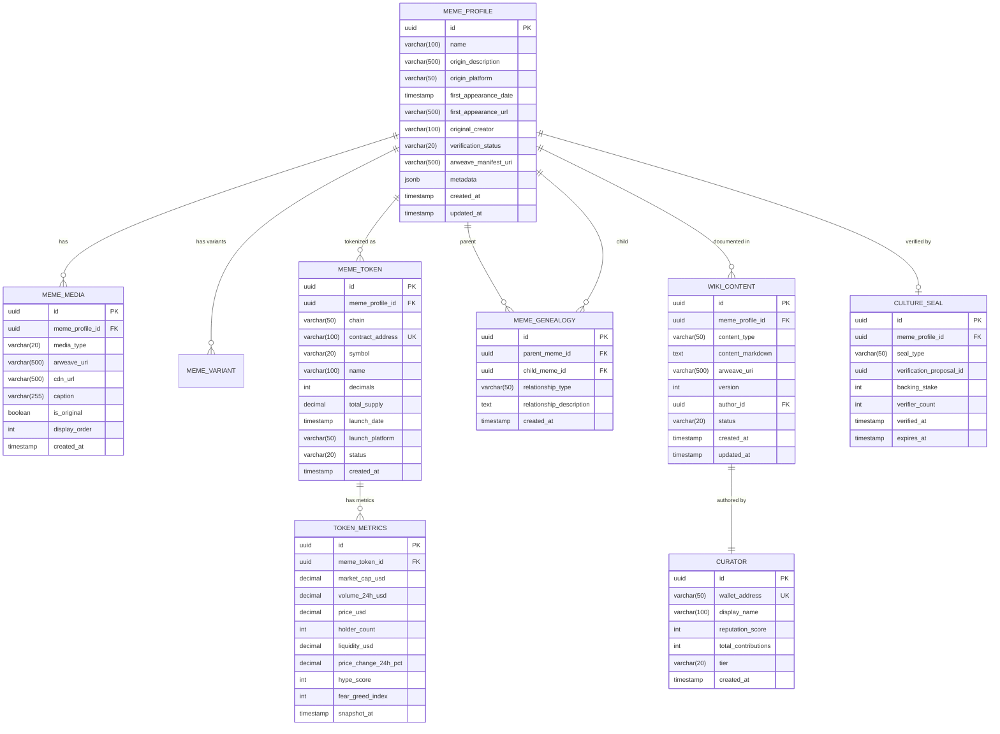

# HLD - CM-MEMEPEDIA (CryptoMeme - MemePedia Web3 Encyclopedia)

> **"Thư viện Alexandria của Web3"** - Bách khoa Toàn thư Meme được Tài chính hóa

---

## 1. Bối cảnh (Context)

### 1.1 Bối cảnh Kinh doanh

#### Sứ mệnh
MemePedia là trụ cột đầu tiên của CryptoMeme.org, hoạt động như một bách khoa toàn thư Web3 kết hợp **dữ liệu văn hóa** (nguồn gốc meme, lịch sử lan truyền) với **dữ liệu tài chính** (thanh khoản, giá cả, volume).

#### Vấn đề Giải quyết
| Vấn đề | Hiện trạng | Giải pháp MemePedia |
|--------|------------|---------------------|
| Phân mảnh thông tin | Người dùng phải chuyển giữa Know Your Meme và DexScreener | Single source of truth |
| Thiếu ngữ cảnh | Biết giá tăng nhưng không hiểu "tại sao" | Cultural context + Financial data |
| Dữ liệu không bền vững | Website meme coin có thể biến mất | Lưu trữ vĩnh viễn trên Arweave |
| Không có gia phả | Không biết mối quan hệ giữa các meme | Meme Genealogy Graph |

#### Tính năng Chính

| Tính năng | Mô tả | Giá trị |
|-----------|-------|---------|
| **Cultural Identity Profiles** | Hồ sơ chi tiết với nguồn gốc, creator, first appearance | Phân biệt dự án có "hào văn hóa" thực sự |
| **Meme Genealogy** | Trực quan hóa mối quan hệ token (Doge → Shiba → Floki) | Hiểu dòng tiền và tiến hóa xu hướng |
| **Immutable Archiving** | Lưu trữ trên Arweave 200+ năm | Di sản văn hóa tồn tại vĩnh viễn |
| **Real-time Market Data** | Tích hợp CoinGecko, DexScreener | Trading decisions informed |
| **Sentiment Analysis** | Hype Score, Fear & Greed Index | Nhận diện xu hướng sớm |

#### Phân khúc Meme Được Theo dõi

| Phân khúc | Ví dụ | Tracking Focus |
|-----------|-------|----------------|
| Blue Chip | DOGE, SHIB | ETF potential, institutional signals |
| Solana Ecosystem | BONK, WIF | Community metrics, velocity |
| PolitiFi | TRUMP, BODEN | Event correlation, prediction market |
| AI Memes | Turbo, AI agents | AI-generated content tracking |

### 1.2 Bối cảnh Hệ thống

#### Web/Mobile Applications

| Layer | Component | Technology | Mô tả |
|-------|-----------|------------|-------|
| WEB | memepedia-web | NextJS 14 | Main encyclopedia với SSR/SSG |
| WEB | memepedia-admin | ReactJS | Content moderation portal |
| MOBILE | memepedia-app | React Native | Mobile encyclopedia |
| GRAPHQL | cm-graph | Apollo GraphQL | BFF cho tất cả frontends |

#### Backend Services

| Service | Technology | Vai trò |
|---------|------------|---------|
| **cm-encyclopedia** | Rust/Actix | Core meme data, genealogy, wiki |
| **cm-content-delivery** | Node.js/Fastify | Content serving, CDN integration |
| **cm-arweave-bridge** | Node.js | Arweave upload/retrieval |
| **cm-coingecko-sync** | Python/FastAPI | Market data synchronization |
| **cm-sentiment** | Python/FastAPI | Social sentiment analysis |

#### Infrastructure

| Component | Technology | Mục đích |
|-----------|------------|----------|
| **Arweave** | Decentralized | Permanent storage (images, wiki) |
| **Helius RPC** | Solana | On-chain token data |
| **Redis** | ElastiCache | API caching |
| **PostgreSQL** | Aurora | Relational data |
| **Neo4j** | Graph DB | Meme genealogy |
| **Elasticsearch** | OpenSearch | Full-text search |

### 1.3 Phạm vi Ngoài (Out of Scope)

| # | Nội dung | Lý do |
|---|----------|-------|
| 1 | Token trading execution | Covered in HLD-CM-SWAP-AGGREGATOR |
| 2 | Proof-of-Culture voting | Covered in HLD-CM-PROOF-OF-CULTURE |
| 3 | Curator rewards | Covered in HLD-CM-SOCIALFI |
| 4 | DAO governance | Covered in HLD-CM-DAO-GOVERNANCE |
| 5 | Premium API | Covered in HLD-CM-PREMIUM-API |

### 1.4 Actors và Quyền hạn

| Actor | Mô tả | Quyền hạn |
|-------|-------|-----------|
| **Visitor** | Người dùng ẩn danh | Browse, search, view public data |
| **Authenticated User** | Đã kết nối wallet | Bookmark, follow, basic contributions |
| **Curator** | Contributor được xác minh | Tạo/edit wiki, submit meme profiles |
| **Chief Curator** | KOL quản lý category | Approve content, manage sections |
| **Admin** | Platform operator | Full CRUD, moderation, system config |

---

## 2. Context Diagram


---

## 3. Core Business Workflow

### 3.1 Meme Profile Creation Workflow


### 3.2 Meme Search & Discovery Flow


### 3.3 Meme Genealogy Visualization


### 3.4 Wiki Content Contribution Flow


---

## 4. State Machine

### 4.1 Meme Profile State Machine


### 4.2 State Transition Rules

| From State | To State | Trigger | Conditions |
|------------|----------|---------|------------|
| DRAFT | PENDING_VERIFICATION | Submit | All required fields filled |
| PENDING_VERIFICATION | VERIFIED | POC Vote | ≥70% FOR, ≥10 stakers |
| PENDING_VERIFICATION | REJECTED | POC Vote | <70% FOR or <10 stakers |
| VERIFIED | FLAGGED | Report | ≥3 community reports |
| FLAGGED | VERIFIED | Admin Action | False positive confirmed |
| FLAGGED | ARCHIVED | Admin Action | Violation confirmed |

---

## 5. Mô hình Dữ liệu (Data Model - ERD)

### 5.1 Entity Relationship Diagram



### 5.2 Table: meme_profile

| Column | Type | Constraints | Description |
|--------|------|-------------|-------------|
| id | UUID | PK, DEFAULT gen_random_uuid() | Unique identifier |
| name | VARCHAR(100) | NOT NULL | Tên meme |
| origin_description | VARCHAR(500) | | Mô tả nguồn gốc |
| origin_platform | VARCHAR(50) | | 4CHAN, REDDIT, TWITTER, TIKTOK, etc |
| first_appearance_date | TIMESTAMP | | Ngày xuất hiện đầu tiên |
| first_appearance_url | VARCHAR(500) | | URL bài post gốc |
| original_creator | VARCHAR(100) | | Người tạo (nếu biết) |
| verification_status | VARCHAR(20) | NOT NULL DEFAULT 'DRAFT' | DRAFT, PENDING, VERIFIED, REJECTED |
| arweave_manifest_uri | VARCHAR(500) | | Arweave manifest cho all media |
| metadata | JSONB | | Metadata mở rộng |
| created_at | TIMESTAMP | NOT NULL DEFAULT NOW() | |
| updated_at | TIMESTAMP | NOT NULL DEFAULT NOW() | |

**Indexes:**
- `idx_meme_profile_name` ON name (GIN trigram for fuzzy search)
- `idx_meme_profile_status` ON verification_status
- `idx_meme_profile_platform` ON origin_platform

### 5.3 Table: meme_token

| Column | Type | Constraints | Description |
|--------|------|-------------|-------------|
| id | UUID | PK | Unique identifier |
| meme_profile_id | UUID | FK → meme_profile(id) | Reference to meme |
| chain | VARCHAR(50) | NOT NULL | SOLANA, ETHEREUM, BASE |
| contract_address | VARCHAR(100) | UNIQUE | Token contract address |
| symbol | VARCHAR(20) | NOT NULL | Token symbol |
| name | VARCHAR(100) | | Token name |
| decimals | INT | DEFAULT 9 | Token decimals |
| total_supply | DECIMAL(30,0) | | Total supply |
| launch_date | TIMESTAMP | | Token launch date |
| launch_platform | VARCHAR(50) | | Pump.fun, Raydium, etc |
| status | VARCHAR(20) | DEFAULT 'ACTIVE' | ACTIVE, INACTIVE, RUGGED |
| created_at | TIMESTAMP | DEFAULT NOW() | |

**Indexes:**
- `idx_meme_token_contract` ON contract_address
- `idx_meme_token_chain` ON chain
- `idx_meme_token_symbol` ON symbol

### 5.4 Table: token_metrics

| Column | Type | Constraints | Description |
|--------|------|-------------|-------------|
| id | UUID | PK | |
| meme_token_id | UUID | FK → meme_token(id) | |
| market_cap_usd | DECIMAL(30,2) | | Market cap in USD |
| volume_24h_usd | DECIMAL(30,2) | | 24h trading volume |
| price_usd | DECIMAL(18,8) | | Current price |
| holder_count | INT | | Number of holders |
| liquidity_usd | DECIMAL(30,2) | | Liquidity in USD |
| price_change_24h_pct | DECIMAL(10,2) | | 24h price change % |
| hype_score | INT | CHECK (0-100) | Social hype score |
| fear_greed_index | INT | CHECK (0-100) | Fear & Greed |
| snapshot_at | TIMESTAMP | NOT NULL | Snapshot time |

**Indexes:**
- `idx_token_metrics_token_time` ON (meme_token_id, snapshot_at DESC)

**Partitioning:** BY RANGE (snapshot_at) - Monthly partitions

### 5.5 Table: meme_genealogy

| Column | Type | Constraints | Description |
|--------|------|-------------|-------------|
| id | UUID | PK | |
| parent_meme_id | UUID | FK → meme_profile(id) | Parent meme |
| child_meme_id | UUID | FK → meme_profile(id) | Derived meme |
| relationship_type | VARCHAR(50) | NOT NULL | DERIVATIVE, PARODY, FORK, SEQUEL |
| relationship_description | TEXT | | Mô tả mối quan hệ |
| created_at | TIMESTAMP | DEFAULT NOW() | |

**Constraints:**
- UNIQUE(parent_meme_id, child_meme_id)
- CHECK(parent_meme_id != child_meme_id)

### 5.6 Table: wiki_content

| Column | Type | Constraints | Description |
|--------|------|-------------|-------------|
| id | UUID | PK | |
| meme_profile_id | UUID | FK → meme_profile(id) | |
| content_type | VARCHAR(50) | NOT NULL | HISTORY, ANALYSIS, TIMELINE |
| content_markdown | TEXT | NOT NULL | Markdown content |
| arweave_uri | VARCHAR(500) | | Archived version |
| version | INT | NOT NULL DEFAULT 1 | Version number |
| author_id | UUID | FK → curator(id) | |
| status | VARCHAR(20) | DEFAULT 'DRAFT' | DRAFT, PUBLISHED, ARCHIVED |
| created_at | TIMESTAMP | DEFAULT NOW() | |
| updated_at | TIMESTAMP | DEFAULT NOW() | |

**Indexes:**
- `idx_wiki_meme_type` ON (meme_profile_id, content_type)

---

## 6. Kiến trúc Sự kiện (Event Architecture)

### 6.1 Published Events

| Event | Trigger | Payload | Consumers |
|-------|---------|---------|-----------|
| `MemeProfileCreatedEvent` | New meme created | {memeId, name, status, creatorId} | cm-arweave-bridge, cm-verification |
| `MemeVerifiedEvent` | POC verification passed | {memeId, sealType, verifierCount} | cm-socialfi, cm-swap, cm-api |
| `MemeMediaUploadedEvent` | Media archived | {memeId, mediaId, arweaveUri} | cm-content-delivery |
| `WikiContentPublishedEvent` | Wiki approved | {memeId, contentId, authorId} | cm-socialfi (rewards), cm-api |
| `TokenMetricsUpdatedEvent` | CoinGecko sync | {tokenId, metrics, snapshotAt} | cm-rug-check, cm-api |
| `MemeGenealogyUpdatedEvent` | Relationship added | {parentId, childId, type} | cm-api |

### 6.2 Consumed Events

| Event | Source | Action |
|-------|--------|--------|
| `CultureSealGrantedEvent` | cm-verification | Update meme verification status |
| `RugDetectedEvent` | cm-rug-check | Flag token, update status to RUGGED |
| `CuratorReputationChangedEvent` | cm-socialfi | Update curator permissions |

### 6.3 Event Schemas

```json
// MemeProfileCreatedEvent
{
  "eventType": "MemeProfileCreatedEvent",
  "eventId": "uuid",
  "timestamp": "2025-01-08T12:00:00Z",
  "data": {
    "memeId": "uuid",
    "name": "Pepe",
    "originPlatform": "4CHAN",
    "verificationStatus": "PENDING_VERIFICATION",
    "creatorId": "uuid",
    "hasMedia": true,
    "mediaCount": 3
  }
}

// TokenMetricsUpdatedEvent
{
  "eventType": "TokenMetricsUpdatedEvent",
  "eventId": "uuid",
  "timestamp": "2025-01-08T12:00:00Z",
  "data": {
    "tokenId": "uuid",
    "contractAddress": "...",
    "chain": "SOLANA",
    "metrics": {
      "priceUsd": 0.0001234,
      "marketCapUsd": 1234567.89,
      "volume24hUsd": 567890.12,
      "holderCount": 12345,
      "hypeScore": 78,
      "fearGreedIndex": 65
    },
    "snapshotAt": "2025-01-08T12:00:00Z"
  }
}
```

---

## 7. API Contracts

### 7.1 GraphQL Schema

```graphql
# Types
type MemeProfile {
  id: ID!
  name: String!
  originDescription: String
  originPlatform: OriginPlatform
  firstAppearanceDate: DateTime
  firstAppearanceUrl: String
  originalCreator: String
  verificationStatus: VerificationStatus!
  cultureSeal: CultureSeal
  media: [MemeMedia!]!
  tokens: [MemeToken!]!
  wikiContent: [WikiContent!]!
  genealogy: GenealogyConnection!
  createdAt: DateTime!
  updatedAt: DateTime!
}

type MemeToken {
  id: ID!
  chain: Chain!
  contractAddress: String!
  symbol: String!
  name: String
  decimals: Int!
  launchDate: DateTime
  launchPlatform: String
  status: TokenStatus!
  latestMetrics: TokenMetrics
}

type TokenMetrics {
  priceUsd: Float!
  marketCapUsd: Float!
  volume24hUsd: Float!
  holderCount: Int!
  liquidityUsd: Float!
  priceChange24hPct: Float!
  hypeScore: Int!
  fearGreedIndex: Int!
  snapshotAt: DateTime!
}

type MemeMedia {
  id: ID!
  mediaType: MediaType!
  arweaveUri: String!
  cdnUrl: String!
  caption: String
  isOriginal: Boolean!
  displayOrder: Int!
}

type WikiContent {
  id: ID!
  contentType: WikiContentType!
  contentMarkdown: String!
  arweaveUri: String
  version: Int!
  author: Curator!
  status: ContentStatus!
  createdAt: DateTime!
}

type CultureSeal {
  sealType: SealType!
  backingStake: Int!
  verifierCount: Int!
  verifiedAt: DateTime!
  expiresAt: DateTime
}

type GenealogyNode {
  meme: MemeProfile!
  relationshipType: RelationshipType!
  description: String
}

type GenealogyConnection {
  ancestors: [GenealogyNode!]!
  descendants: [GenealogyNode!]!
}

# Enums
enum OriginPlatform {
  FOUR_CHAN
  REDDIT
  TWITTER
  TIKTOK
  TELEGRAM
  DISCORD
  UNKNOWN
}

enum VerificationStatus {
  DRAFT
  PENDING_VERIFICATION
  VERIFIED
  REJECTED
  FLAGGED
  ARCHIVED
}

enum Chain {
  SOLANA
  ETHEREUM
  BASE
  ARBITRUM
}

enum TokenStatus {
  ACTIVE
  INACTIVE
  RUGGED
}

enum MediaType {
  IMAGE
  VIDEO
  GIF
  AUDIO
}

enum SealType {
  COMMUNITY_VERIFIED
  KOL_ENDORSED
  ECOSYSTEM_CERTIFIED
}

enum RelationshipType {
  DERIVATIVE
  PARODY
  FORK
  SEQUEL
}

# Queries
type Query {
  memeProfile(id: ID!): MemeProfile
  memeProfileByContract(contractAddress: String!): MemeProfile

  searchMemes(
    query: String!
    filters: MemeFilters
    pagination: Pagination
  ): MemeSearchResult!

  trendingMemes(
    timeframe: Timeframe
    limit: Int
  ): [MemeProfile!]!

  memeGenealogy(
    memeId: ID!
    depth: Int = 2
  ): GenealogyGraph!

  tokenMetricsHistory(
    tokenId: ID!
    from: DateTime!
    to: DateTime!
    interval: MetricsInterval
  ): [TokenMetrics!]!
}

# Mutations
type Mutation {
  createMemeProfile(input: CreateMemeProfileInput!): MemeProfile!
  updateMemeProfile(id: ID!, input: UpdateMemeProfileInput!): MemeProfile!

  addMemeMedia(memeId: ID!, input: AddMediaInput!): MemeMedia!
  removeMemeMedia(mediaId: ID!): Boolean!

  contributeWikiContent(
    memeId: ID!
    input: WikiContentInput!
  ): WikiContent!

  addGenealogyRelationship(
    parentId: ID!
    childId: ID!
    input: GenealogyInput!
  ): MemeGenealogy!

  linkTokenToMeme(
    memeId: ID!
    input: LinkTokenInput!
  ): MemeToken!
}

# Input Types
input CreateMemeProfileInput {
  name: String!
  originDescription: String
  originPlatform: OriginPlatform
  firstAppearanceDate: DateTime
  firstAppearanceUrl: String
  originalCreator: String
  media: [MediaUploadInput!]
}

input MemeFilters {
  verificationStatus: [VerificationStatus!]
  originPlatform: [OriginPlatform!]
  chain: [Chain!]
  hasCultureSeal: Boolean
  minMarketCap: Float
  maxMarketCap: Float
}
```

### 7.2 REST Endpoints (cm-api-gateway)

| Method | Endpoint | Description | Auth |
|--------|----------|-------------|------|
| GET | `/api/v1/memes` | List memes với filters | Optional |
| GET | `/api/v1/memes/{id}` | Get meme profile | Optional |
| GET | `/api/v1/memes/search` | Full-text search | Optional |
| GET | `/api/v1/memes/{id}/genealogy` | Get family tree | Optional |
| GET | `/api/v1/memes/{id}/metrics` | Get token metrics | API Key |
| GET | `/api/v1/memes/{id}/history` | Historical metrics | API Key |
| POST | `/api/v1/memes` | Create meme (Curator) | JWT |
| PUT | `/api/v1/memes/{id}` | Update meme | JWT |

### 7.3 Sample API Request/Response

```bash
# Search memes
curl -X GET "https://api.cryptomeme.org/api/v1/memes/search?q=dog&chain=SOLANA&limit=10" \
  -H "Accept: application/json"

# Response
{
  "data": [
    {
      "id": "550e8400-e29b-41d4-a716-446655440000",
      "name": "Dogwifhat",
      "symbol": "WIF",
      "verificationStatus": "VERIFIED",
      "cultureSeal": {
        "type": "COMMUNITY_VERIFIED",
        "verifierCount": 127
      },
      "token": {
        "chain": "SOLANA",
        "contractAddress": "EKpQGSJtjMFqKZ...",
        "latestMetrics": {
          "priceUsd": 2.34,
          "marketCapUsd": 2340000000,
          "volume24hUsd": 123000000,
          "hypeScore": 85
        }
      },
      "media": [
        {
          "cdnUrl": "https://cdn.cryptomeme.org/wif-original.png",
          "isOriginal": true
        }
      ]
    }
  ],
  "pagination": {
    "total": 156,
    "page": 1,
    "limit": 10
  }
}
```

---

## 8. Integration Points

| Integration | Direction | Protocol | Purpose |
|-------------|-----------|----------|---------|
| **Arweave Network** | Outbound | HTTP/GraphQL | Permanent media & content storage |
| **CoinGecko API** | Outbound | REST | Token prices, volume, market cap |
| **DexScreener API** | Outbound | REST | DEX trading data |
| **The Tie API** | Outbound | REST | Sentiment analysis |
| **Helius RPC** | Outbound | JSON-RPC | On-chain token data |
| **cm-verification** | Internal | gRPC/Kafka | Request/receive verification |
| **cm-rug-check** | Internal | Kafka | Receive security alerts |
| **cm-socialfi** | Internal | Kafka | Curator events |
| **Elasticsearch** | Internal | REST | Full-text search |
| **Neo4j** | Internal | Bolt | Genealogy queries |

---

## 9. Non-Functional Requirements

### 9.1 Performance

| Metric | Target | Implementation |
|--------|--------|----------------|
| Search latency (p99) | < 200ms | Elasticsearch, Redis caching |
| Page load (SSR) | < 1s | NextJS ISR, CDN |
| Genealogy render | < 500ms | Neo4j optimized queries |
| API response | < 100ms | Redis cache, read replicas |

### 9.2 Scalability

| Aspect | Approach |
|--------|----------|
| Read scaling | CDN, Read replicas, Redis caching |
| Write scaling | Event-driven async processing |
| Search scaling | Elasticsearch cluster (3+ nodes) |
| Storage scaling | Arweave (unlimited), S3 for temp |

### 9.3 Storage Strategy

| Data Type | Storage | TTL/Retention |
|-----------|---------|---------------|
| Meme images/videos | Arweave | Permanent (200+ years) |
| Wiki content | Arweave + PostgreSQL | Permanent |
| Token metrics | PostgreSQL (partitioned) | 2 years, then aggregate |
| API cache | Redis | 5-60 minutes |
| Search index | Elasticsearch | Synced with DB |

### 9.4 Availability

| Component | Target | Strategy |
|-----------|--------|----------|
| Web | 99.9% | Multi-AZ, CDN failover |
| API | 99.9% | Multi-AZ, load balancing |
| Database | 99.99% | Aurora multi-AZ, read replicas |
| Search | 99.5% | ES cluster với replicas |

### 9.5 Security

| Concern | Implementation |
|---------|----------------|
| Input validation | Schema validation, sanitization |
| Rate limiting | Redis-based, per-endpoint |
| Authentication | Privy JWT, wallet signature |
| Authorization | RBAC (Visitor, User, Curator, Admin) |
| Data privacy | Encryption at rest, TLS 1.3 |

---

## 10. Appendix

### 10.1 Glossary

| Term | Definition |
|------|------------|
| **Culture Seal** | Badge xác nhận meme đã được verify bởi cộng đồng |
| **Genealogy** | Mối quan hệ cha-con giữa các meme |
| **Arweave** | Blockchain lưu trữ dữ liệu vĩnh viễn |
| **Hype Score** | Điểm đo lường "sức nóng" trên social media (0-100) |
| **Fear & Greed Index** | Chỉ số tâm lý thị trường (0-100) |

### 10.2 Related Documents

- [HLD-CM-PROOF-OF-CULTURE](./HLD-CM-PROOF-OF-CULTURE.md) - Cơ chế xác thực
- [HLD-CM-SOCIALFI](./HLD-CM-SOCIALFI.md) - Curator rewards
- [HLD-CM-SWAP-AGGREGATOR](../Features/HLD-CM-SWAP-AGGREGATOR.md) - Trading
- [Tech-Stack](../../Design/Tech-Stack.md) - Technology choices
