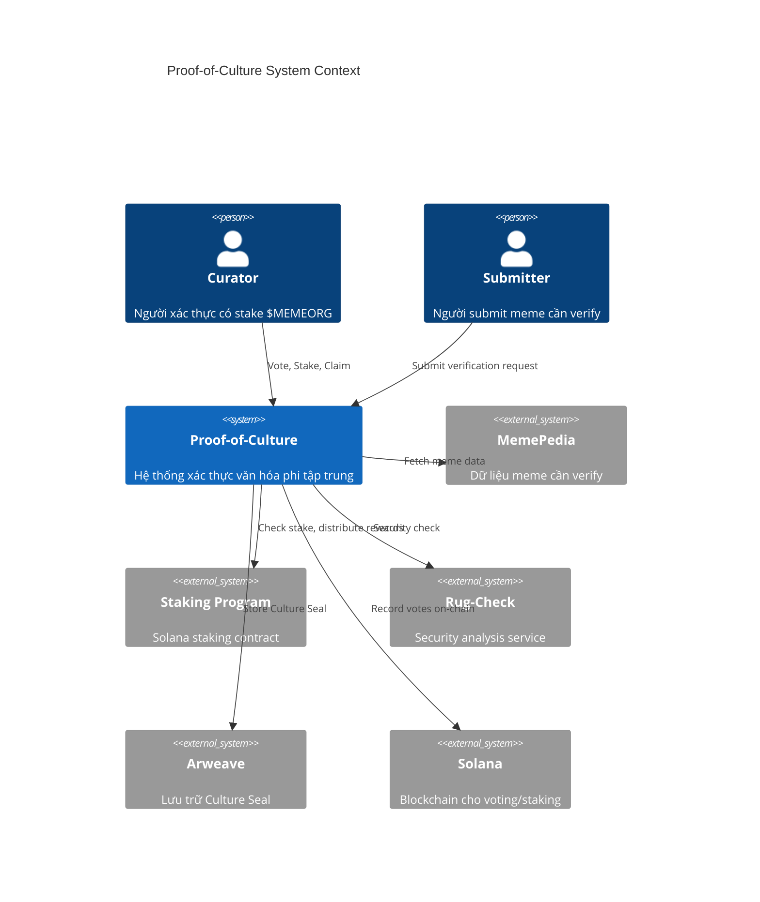
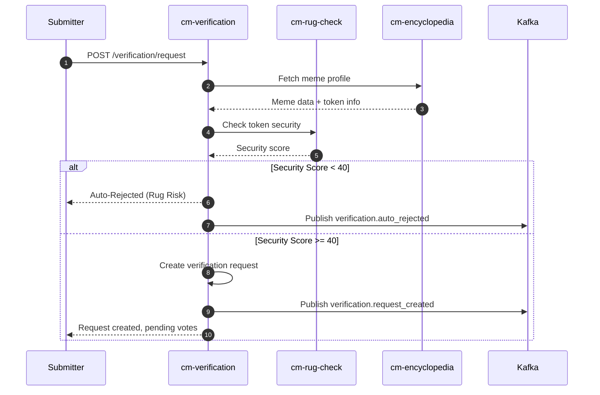
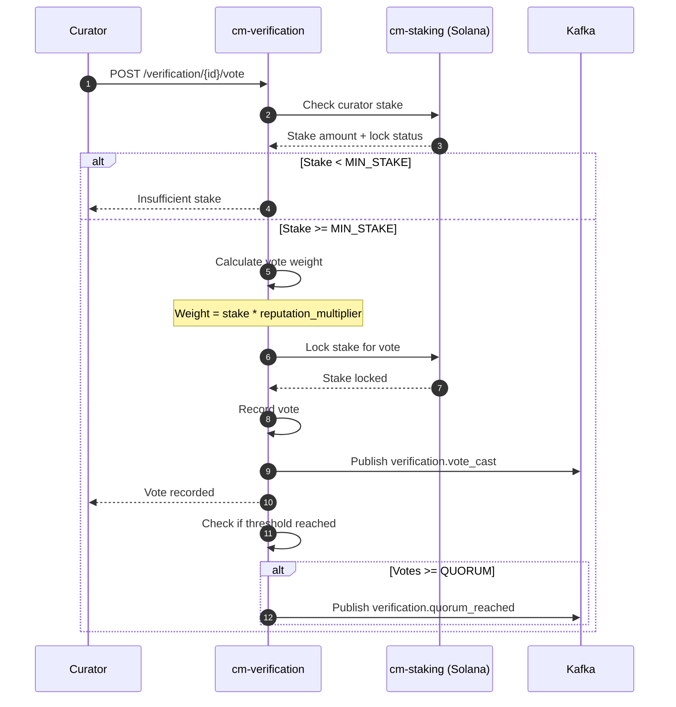
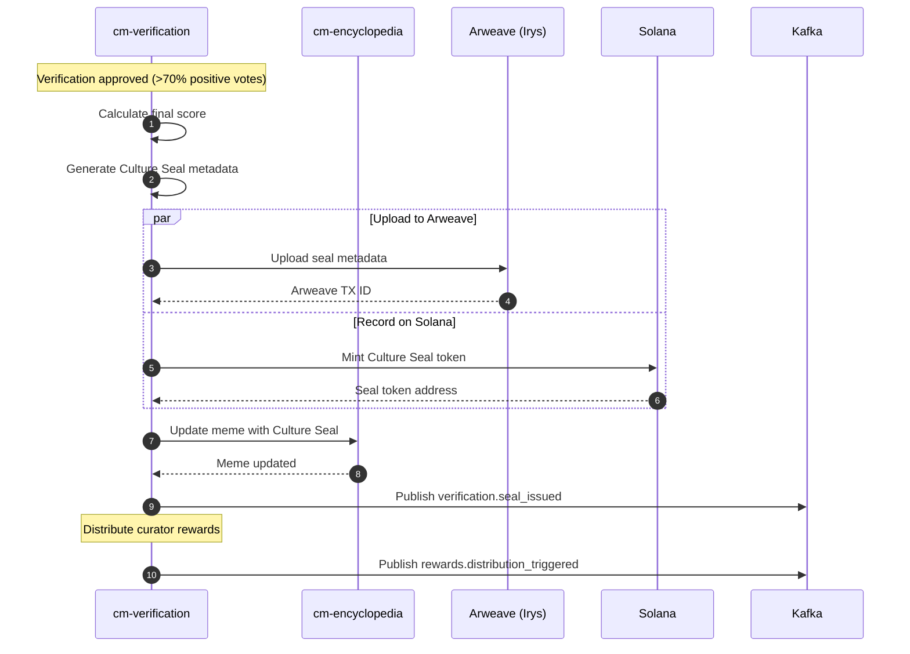
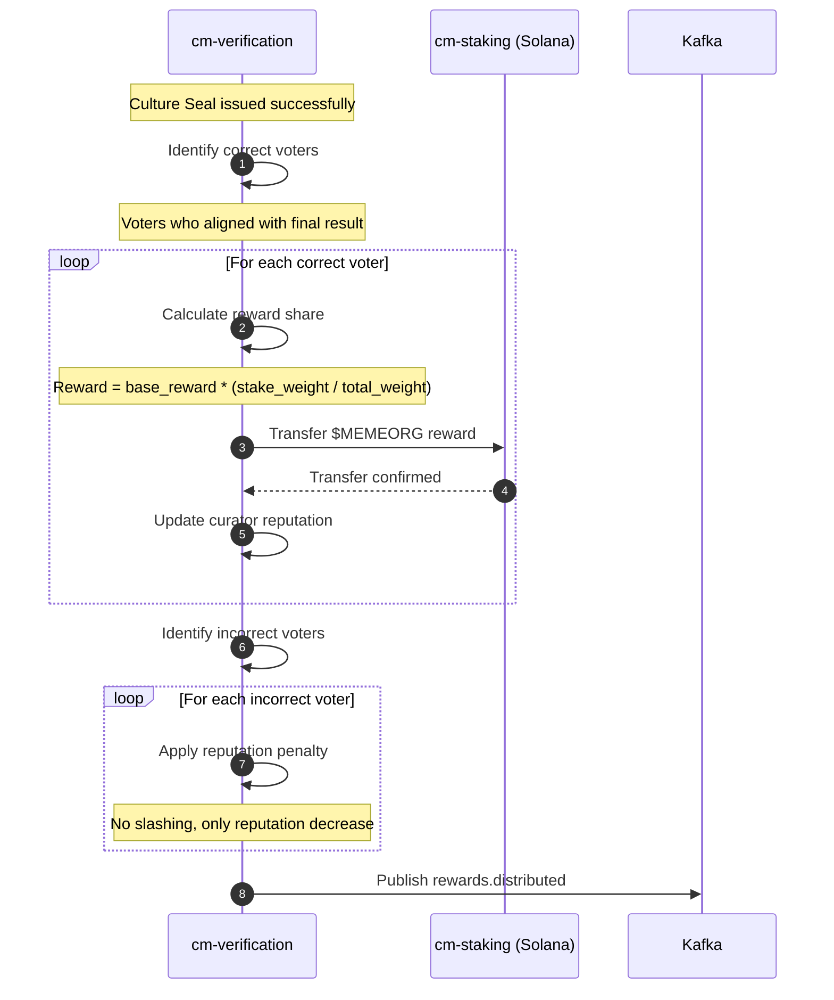
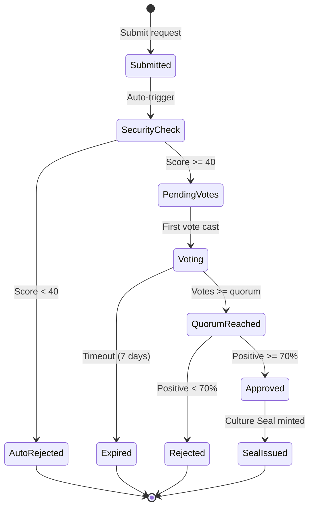
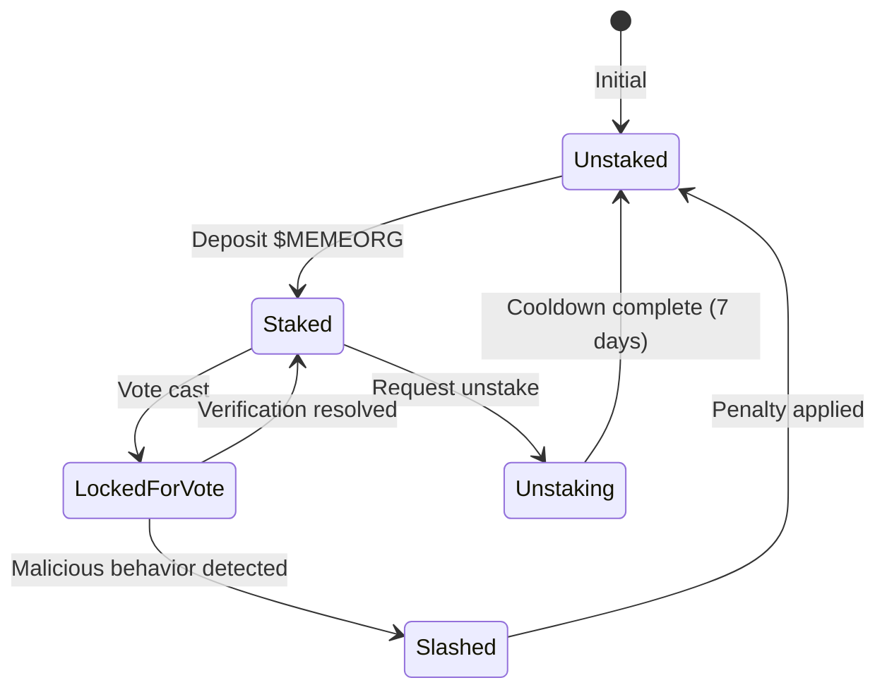
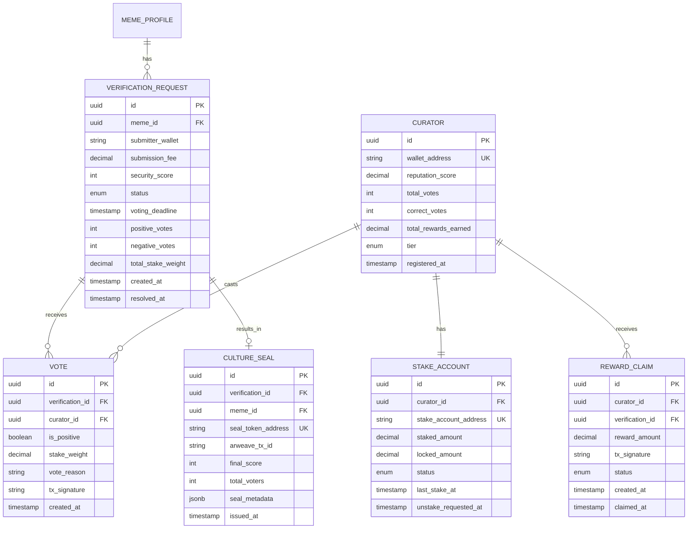
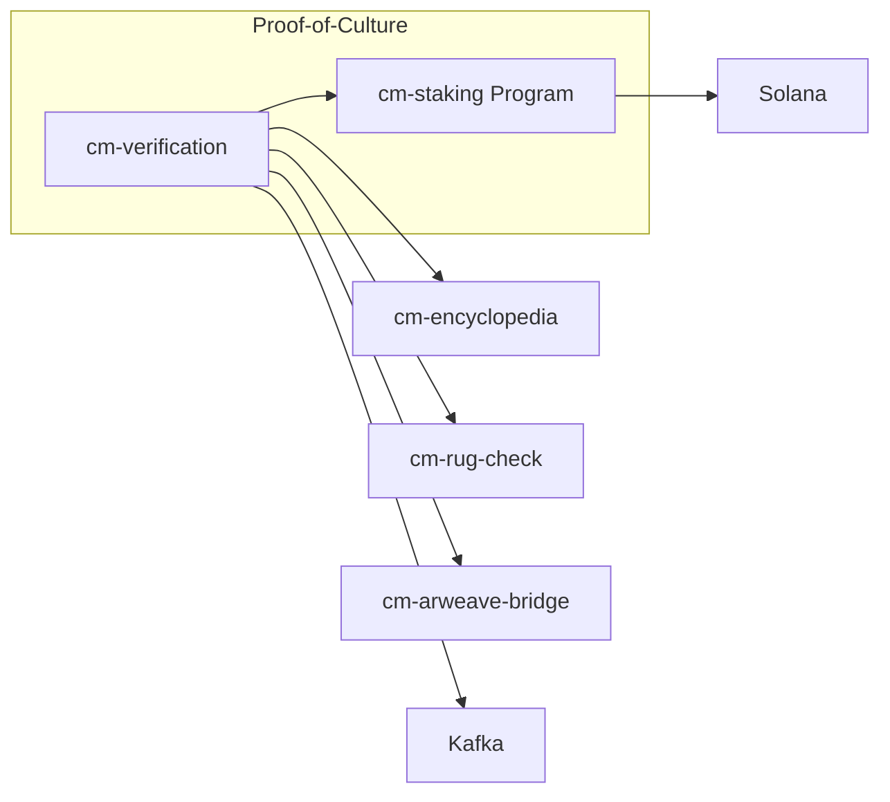

# HLD-CM-PROOF-OF-CULTURE - Hệ thống Xác thực Văn hóa

> **Pillar 2**: Proof-of-Culture - Cơ chế xác thực văn hóa phi tập trung
>
> **Service**: `cm-verification` (Rust/Actix) + `cm-staking` (Solana Program)
>
> **Version**: 1.0 | **Last Updated**: 2025-01

---

## 📋 Mục lục

1. [Bối cảnh (Context)](#1-bối-cảnh-context)
2. [Context Diagram](#2-context-diagram)
3. [Core Business Workflows](#3-core-business-workflows)
4. [State Machine](#4-state-machine)
5. [Data Model](#5-data-model)
6. [Event Architecture](#6-event-architecture)
7. [API Contracts](#7-api-contracts)
8. [Integration Points](#8-integration-points)
9. [Non-Functional Requirements](#9-non-functional-requirements)
10. [Appendix](#10-appendix)

---

## 1. Bối cảnh (Context)

### 1.1 Bối cảnh Kinh doanh

**Vấn đề:**
- Thị trường meme coin tràn ngập thông tin sai lệch và token lừa đảo
- Không có cơ chế đáng tin cậy để xác thực tính "chính thống" của meme
- Các hệ thống đánh giá tập trung dễ bị thao túng và thiếu minh bạch
- Nhà đầu tư thiếu công cụ phân biệt meme có giá trị văn hóa thực sự

**Giải pháp Proof-of-Culture:**
- Cơ chế xác thực phi tập trung dựa trên stake $MEMEORG
- "Culture Seal" - dấu chứng nhận văn hóa on-chain không thể giả mạo
- Tích hợp Rug-Check tự động loại bỏ token nguy hiểm
- Hệ thống voting có trọng số theo stake và reputation

**Giá trị mang lại:**
| Stakeholder | Giá trị |
|-------------|---------|
| Nhà đầu tư | Tin tưởng vào meme đã được xác thực, giảm rủi ro rug pull |
| Curators | Kiếm rewards từ việc xác thực đúng, xây dựng reputation |
| Dự án token | Được "chứng nhận" chính thức, tăng độ tin cậy |
| Hệ sinh thái | Nâng cao chất lượng tổng thể, loại bỏ scam |

### 1.2 Bối cảnh Hệ thống

**Proof-of-Culture** là pillar thứ 2 trong hệ sinh thái CryptoMeme.org, đảm nhận vai trò:

1. **Verification Engine** - Xử lý logic xác thực văn hóa
2. **Staking Integration** - Quản lý stake $MEMEORG cho voting
3. **Culture Seal Issuance** - Cấp dấu chứng nhận on-chain
4. **Rug-Check Gateway** - Tích hợp kiểm tra an ninh tự động

**Services liên quan:**
- `cm-verification` (Rust/Actix) - Core verification logic
- `cm-staking` (Solana Program) - On-chain staking
- `cm-rug-check` (Node.js) - Security analysis
- `cm-encyclopedia` (Rust) - Meme data provider

### 1.3 Phạm vi Ngoài (Out of Scope)

| Phạm vi trong | Phạm vi ngoài |
|---------------|---------------|
| Verification workflow | Content moderation chi tiết |
| Staking mechanism | Token economics thiết kế |
| Culture Seal issuance | NFT marketplace |
| Rug-check integration | Deep security audit |
| Curator rewards calculation | Payment processing |

### 1.4 Actors & Permissions

| Actor | Mô tả | Permissions |
|-------|-------|-------------|
| **Curator** | Người xác thực có stake | Vote, stake, claim rewards |
| **Verified Curator** | Curator có reputation cao | Weighted voting, propose verification |
| **Submitter** | Người submit meme cần xác thực | Submit request, pay fee |
| **Rug-Check Bot** | Service tự động | Auto-reject, flag suspicious |
| **DAO Admin** | Multi-sig governance | Configure thresholds, slash |

---

## 2. Context Diagram



---

## 3. Core Business Workflows

### 3.1 Verification Request Flow



### 3.2 Curator Voting Flow



### 3.3 Culture Seal Issuance Flow



### 3.4 Curator Rewards Distribution



---

## 4. State Machine

### 4.1 Verification Request States



### 4.2 Curator Stake States



---

## 5. Data Model

### 5.1 Entity Relationship Diagram



### 5.2 Key Entities

| Entity | Mô tả | Storage |
|--------|-------|---------|
| `VERIFICATION_REQUEST` | Yêu cầu xác thực cho meme | PostgreSQL |
| `VOTE` | Phiếu bầu của curator | PostgreSQL + Solana |
| `CURATOR` | Thông tin curator | PostgreSQL |
| `STAKE_ACCOUNT` | Tài khoản stake on-chain | PostgreSQL (mirror) + Solana |
| `CULTURE_SEAL` | Dấu chứng nhận đã cấp | PostgreSQL + Arweave |
| `REWARD_CLAIM` | Lịch sử nhận rewards | PostgreSQL |

---

## 6. Event Architecture

### 6.1 Published Events

| Event | Trigger | Payload | Consumers |
|-------|---------|---------|-----------|
| `verification.request_created` | New request submitted | `{request_id, meme_id, submitter}` | cm-notification, cm-analytics |
| `verification.auto_rejected` | Security score too low | `{request_id, meme_id, security_score}` | cm-encyclopedia, cm-notification |
| `verification.vote_cast` | Curator votes | `{request_id, curator_id, vote, weight}` | cm-analytics |
| `verification.quorum_reached` | Enough votes collected | `{request_id, total_votes, deadline}` | cm-verification (self) |
| `verification.approved` | Verification passed | `{request_id, meme_id, final_score}` | cm-encyclopedia, cm-arweave-bridge |
| `verification.rejected` | Verification failed | `{request_id, meme_id, reason}` | cm-encyclopedia, cm-notification |
| `verification.seal_issued` | Culture Seal minted | `{seal_id, meme_id, arweave_tx, token_address}` | cm-encyclopedia, cm-api |
| `rewards.distributed` | Curator rewards sent | `{verification_id, total_amount, recipients[]}` | cm-notification |

### 6.2 Consumed Events

| Event | Source | Handler |
|-------|--------|---------|
| `meme.created` | cm-encyclopedia | Auto-create verification request nếu eligible |
| `meme.token_linked` | cm-encyclopedia | Trigger security check |
| `rugcheck.completed` | cm-rug-check | Update security score |
| `staking.deposited` | cm-staking | Update curator stake balance |
| `staking.withdrawn` | cm-staking | Update curator stake balance |

---

## 7. API Contracts

### 7.1 GraphQL Schema

```graphql
# Types
type VerificationRequest {
  id: ID!
  meme: MemeProfile!
  submitter: String!
  status: VerificationStatus!
  securityScore: Int!
  positiveVotes: Int!
  negativeVotes: Int!
  totalStakeWeight: Float!
  votingDeadline: DateTime!
  cultureSeal: CultureSeal
  votes: [Vote!]!
  createdAt: DateTime!
  resolvedAt: DateTime
}

enum VerificationStatus {
  SUBMITTED
  SECURITY_CHECK
  AUTO_REJECTED
  PENDING_VOTES
  VOTING
  QUORUM_REACHED
  APPROVED
  REJECTED
  EXPIRED
  SEAL_ISSUED
}

type Vote {
  id: ID!
  curator: Curator!
  isPositive: Boolean!
  stakeWeight: Float!
  reason: String
  txSignature: String!
  createdAt: DateTime!
}

type Curator {
  id: ID!
  walletAddress: String!
  reputationScore: Float!
  tier: CuratorTier!
  totalVotes: Int!
  correctVotes: Int!
  accuracyRate: Float!
  stakedAmount: Float!
  lockedAmount: Float!
  totalRewardsEarned: Float!
  recentVotes: [Vote!]!
}

enum CuratorTier {
  NOVICE      # 0-50 votes
  CONTRIBUTOR # 51-200 votes
  EXPERT      # 201-500 votes
  MASTER      # 500+ votes, >80% accuracy
}

type CultureSeal {
  id: ID!
  meme: MemeProfile!
  tokenAddress: String!
  arweaveTxId: String!
  finalScore: Int!
  totalVoters: Int!
  metadata: JSONObject!
  issuedAt: DateTime!
}

type RewardClaim {
  id: ID!
  verificationRequest: VerificationRequest!
  amount: Float!
  txSignature: String
  status: ClaimStatus!
  createdAt: DateTime!
  claimedAt: DateTime
}

enum ClaimStatus {
  PENDING
  CLAIMED
  EXPIRED
}

# Queries
type Query {
  # Verification
  verificationRequest(id: ID!): VerificationRequest
  verificationRequests(
    status: VerificationStatus
    memeId: ID
    first: Int = 20
    after: String
  ): VerificationRequestConnection!

  pendingVerifications(first: Int = 20): [VerificationRequest!]!

  # Curator
  curator(walletAddress: String!): Curator
  curatorLeaderboard(
    tier: CuratorTier
    first: Int = 50
  ): [Curator!]!

  myCuratorProfile: Curator
  myVotes(first: Int = 20, after: String): VoteConnection!
  myPendingRewards: [RewardClaim!]!

  # Culture Seal
  cultureSeal(memeId: ID!): CultureSeal
  recentCultureSeals(first: Int = 20): [CultureSeal!]!
}

# Mutations
type Mutation {
  # Verification
  submitVerificationRequest(
    input: SubmitVerificationInput!
  ): VerificationRequest!

  castVote(input: CastVoteInput!): Vote!

  # Staking
  registerAsCurator: Curator!

  stakeTokens(
    amount: Float!
    signedTransaction: String!
  ): StakeResult!

  unstakeTokens(
    amount: Float!
    signedTransaction: String!
  ): UnstakeResult!

  # Rewards
  claimReward(rewardId: ID!): RewardClaim!
  claimAllRewards: [RewardClaim!]!
}

input SubmitVerificationInput {
  memeId: ID!
  submissionFee: Float!
  signedTransaction: String!
}

input CastVoteInput {
  verificationId: ID!
  isPositive: Boolean!
  reason: String
  signedTransaction: String!
}

type StakeResult {
  success: Boolean!
  newStakedAmount: Float!
  txSignature: String!
}

type UnstakeResult {
  success: Boolean!
  unstakeRequestedAt: DateTime!
  availableAt: DateTime!
  txSignature: String!
}

# Subscriptions
type Subscription {
  verificationUpdated(id: ID!): VerificationRequest!
  newVoteOnVerification(verificationId: ID!): Vote!
  rewardAvailable(curatorWallet: String!): RewardClaim!
}
```

### 7.2 REST Endpoints (Internal)

| Method | Endpoint | Mô tả |
|--------|----------|-------|
| `GET` | `/api/v1/verification/{id}` | Lấy chi tiết verification |
| `POST` | `/api/v1/verification/request` | Tạo verification request |
| `POST` | `/api/v1/verification/{id}/vote` | Cast vote |
| `GET` | `/api/v1/curator/{wallet}` | Lấy thông tin curator |
| `POST` | `/api/v1/curator/register` | Đăng ký curator mới |
| `GET` | `/api/v1/staking/balance/{wallet}` | Lấy stake balance |
| `POST` | `/api/v1/rewards/claim/{id}` | Claim reward |

### 7.3 Solana Program Instructions

```rust
// cm-staking program instructions
pub enum StakingInstruction {
    /// Initialize staking pool
    InitializePool {
        min_stake: u64,
        cooldown_period: i64,
    },

    /// Deposit $MEMEORG to stake
    Stake {
        amount: u64,
    },

    /// Request unstake (starts cooldown)
    RequestUnstake {
        amount: u64,
    },

    /// Complete unstake after cooldown
    CompleteUnstake {},

    /// Lock stake for voting
    LockForVote {
        verification_id: [u8; 32],
        amount: u64,
    },

    /// Unlock stake after verification resolved
    UnlockFromVote {
        verification_id: [u8; 32],
    },

    /// Distribute rewards to curator
    DistributeReward {
        curator: Pubkey,
        amount: u64,
    },

    /// Slash stake for malicious behavior
    SlashStake {
        curator: Pubkey,
        amount: u64,
        reason: String,
    },
}
```

---

## 8. Integration Points

### 8.1 External Integrations

| System | Integration Type | Mục đích |
|--------|------------------|----------|
| **Solana (Helius RPC)** | Blockchain RPC | Staking, voting on-chain |
| **Arweave (Irys)** | Permanent storage | Lưu Culture Seal metadata |
| **cm-rug-check** | Internal service | Security scoring |

### 8.2 Internal Service Dependencies



### 8.3 Data Flow Summary

| Source | Destination | Data | Protocol |
|--------|-------------|------|----------|
| cm-verification | cm-rug-check | Token address | REST |
| cm-verification | cm-staking | Stake/lock instructions | Solana TX |
| cm-verification | Arweave | Culture Seal metadata | Irys SDK |
| cm-verification | Kafka | Verification events | Kafka |
| cm-staking | cm-verification | Stake balance updates | Solana subscription |

---

## 9. Non-Functional Requirements

### 9.1 Performance

| Metric | Target | Đo lường |
|--------|--------|----------|
| Vote processing | < 2s (off-chain) + block time | P95 latency |
| Verification query | < 100ms | P95 latency |
| Staking transaction | < 1 block (~400ms) | Solana confirmation |
| Reward distribution | < 5 minutes post-resolution | End-to-end |

### 9.2 Scalability

| Dimension | Target |
|-----------|--------|
| Concurrent verifications | 1,000+ active |
| Votes per second | 100+ TPS |
| Active curators | 10,000+ |
| Culture Seals issued | 100+ per day |

### 9.3 Security

| Aspect | Requirement |
|--------|-------------|
| Stake manipulation | Solana program validation |
| Vote manipulation | Signature verification |
| Sybil attack | Minimum stake requirement |
| Reward gaming | Cooldown + slashing mechanism |

### 9.4 Availability

| Component | Target SLA |
|-----------|------------|
| Verification API | 99.9% |
| Staking Program | 99.99% (Solana network) |
| Vote recording | 99.9% |

---

## 10. Appendix

### 10.1 Verification Thresholds

| Parameter | Giá trị | Mô tả |
|-----------|---------|-------|
| `MIN_SECURITY_SCORE` | 40 | Điểm tối thiểu để không bị auto-reject |
| `MIN_CURATOR_STAKE` | 1,000 $MEMEORG | Stake tối thiểu để vote |
| `QUORUM_PERCENTAGE` | 10% | % active curators cần vote |
| `APPROVAL_THRESHOLD` | 70% | % positive votes để approved |
| `VOTING_PERIOD` | 7 days | Thời gian voting |
| `STAKE_COOLDOWN` | 7 days | Thời gian chờ unstake |
| `SUBMISSION_FEE` | 50 $MEMEORG | Phí submit verification |

### 10.2 Curator Tier Requirements

| Tier | Votes Required | Accuracy | Benefits |
|------|----------------|----------|----------|
| Novice | 0-50 | Any | 1x vote weight |
| Contributor | 51-200 | >60% | 1.5x vote weight |
| Expert | 201-500 | >70% | 2x vote weight, priority notifications |
| Master | 500+ | >80% | 3x vote weight, governance voting |

### 10.3 Reward Formula

```
curator_reward = base_reward * (curator_stake_weight / total_correct_stake_weight) * tier_multiplier

where:
- base_reward = submission_fee * 0.8 (80% goes to curators)
- curator_stake_weight = staked_amount * reputation_multiplier
- tier_multiplier = {novice: 1, contributor: 1.2, expert: 1.5, master: 2.0}
```

### 10.4 Culture Seal Metadata Structure

```json
{
  "version": "1.0",
  "type": "CultureSeal",
  "meme": {
    "id": "uuid",
    "name": "Meme Name",
    "ticker": "$MEME",
    "token_address": "..."
  },
  "verification": {
    "request_id": "uuid",
    "security_score": 85,
    "total_votes": 150,
    "positive_votes": 120,
    "approval_rate": 0.8,
    "voting_period": {
      "start": "2025-01-01T00:00:00Z",
      "end": "2025-01-08T00:00:00Z"
    }
  },
  "seal": {
    "final_score": 82,
    "tier": "VERIFIED",
    "issued_at": "2025-01-08T12:00:00Z",
    "issuer": "CryptoMeme DAO"
  },
  "curators": {
    "total_participated": 150,
    "top_contributors": ["wallet1...", "wallet2...", "wallet3..."]
  }
}
```

### 10.5 Related Documents

- [HLD-CM-MEMEPEDIA.md](./HLD-CM-MEMEPEDIA.md) - Meme data provider
- [HLD-CM-RUG-CHECK.md](../Features/HLD-CM-RUG-CHECK.md) - Security scoring
- [HLD-CM-DAO-GOVERNANCE.md](../Features/HLD-CM-DAO-GOVERNANCE.md) - DAO voting
- [Tech-Stack.md](../../../Design/Tech-Stack.md) - Technology stack
