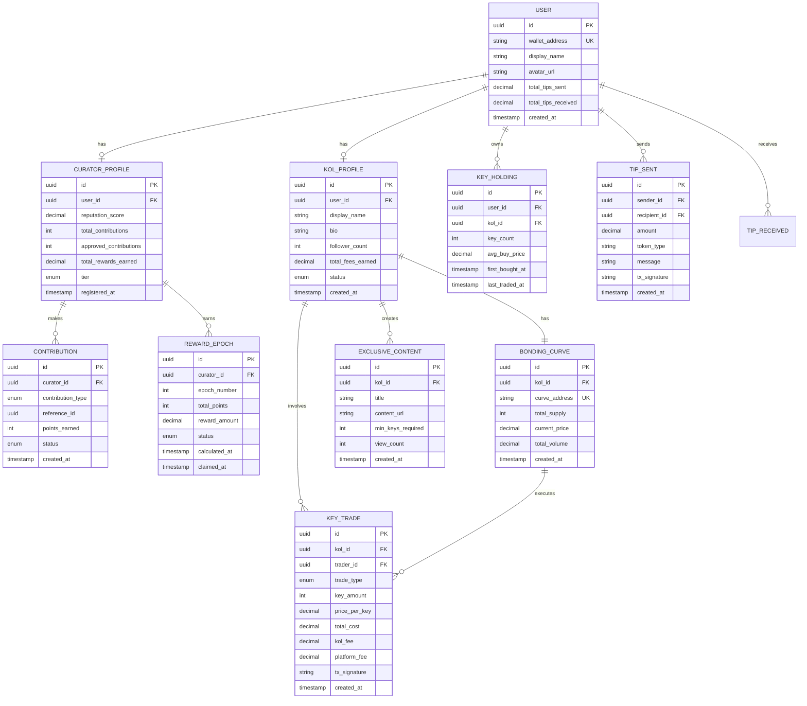

# HLD-CM-SOCIALFI - Kinh tế Nhà sáng tạo

> **Pillar 3**: SocialFi - Creator Economy & KOL Keys
>
> **Service**: `cm-socialfi` (Rust/Actix) + `cm-kol-keys` (Solana Program)
>
> **Version**: 1.0 | **Last Updated**: 2025-01

---

## 📋 Mục lục

1. [Bối cảnh (Context)](#1-bối-cảnh-context)
2. [Context Diagram](#2-context-diagram)
3. [Core Business Workflows](#3-core-business-workflows)
4. [State Machine](#4-state-machine)
5. [Data Model](#5-data-model)
6. [Event Architecture](#6-event-architecture)
7. [API Contracts](#7-api-contracts)
8. [Integration Points](#8-integration-points)
9. [Non-Functional Requirements](#9-non-functional-requirements)
10. [Appendix](#10-appendix)

---

## 1. Bối cảnh (Context)

### 1.1 Bối cảnh Kinh doanh

**Vấn đề:**
- Curators và content creators không được đền bù xứng đáng cho công sức
- KOLs thiếu cơ chế monetize influence một cách trực tiếp
- Mối quan hệ KOL-fan là một chiều, thiếu exclusive access
- Không có hệ thống reputation minh bạch cho curators

**Giải pháp SocialFi:**
- **Curator Rewards**: Phần thưởng cho việc đóng góp nội dung, xác thực đúng
- **KOL Keys**: Bonding curve cho phép fans mua "Keys" để access nội dung exclusive
- **Reputation System**: Hệ thống điểm reputation dựa trên contributions
- **Tipping & Donations**: Cho phép users tip creators trực tiếp

**Giá trị mang lại:**
| Stakeholder | Giá trị |
|-------------|---------|
| Curators | Kiếm thu nhập từ đóng góp nội dung và verification |
| KOLs | Monetize influence, build closer community |
| Fans/Holders | Exclusive access, potential investment upside |
| Platform | Tăng engagement, retention, network effects |

### 1.2 Bối cảnh Hệ thống

**SocialFi** là pillar thứ 3 trong hệ sinh thái CryptoMeme.org, quản lý:

1. **Curator Economy** - Rewards cho content contributions
2. **KOL Keys System** - Bonding curve marketplace cho KOL access
3. **Reputation Engine** - Tính toán và tracking reputation scores
4. **Social Features** - Tips, follows, exclusive content

**Services liên quan:**
- `cm-socialfi` (Rust/Actix) - Core SocialFi logic
- `cm-kol-keys` (Solana Program) - On-chain bonding curves
- `cm-verification` (Rust) - Verification rewards source
- `cm-encyclopedia` (Rust) - Content contributions tracking

### 1.3 Phạm vi Ngoài (Out of Scope)

| Phạm vi trong | Phạm vi ngoài |
|---------------|---------------|
| Curator rewards calculation | Payment gateway integration |
| KOL Keys bonding curve | Fiat on-ramp |
| Reputation scoring | Social media integration |
| Tipping mechanism | Chat/messaging features |
| Exclusive content gating | Content hosting/streaming |

### 1.4 Actors & Permissions

| Actor | Mô tả | Permissions |
|-------|-------|-------------|
| **Curator** | Người đóng góp nội dung | Contribute, earn rewards, tip |
| **KOL** | Key Opinion Leader | Create Keys, post exclusive content |
| **Key Holder** | Người sở hữu KOL Keys | Access exclusive content, trade keys |
| **Fan** | Người theo dõi | Follow, tip, buy keys |
| **Platform** | CryptoMeme DAO | Configure fees, moderate |

---

## 2. Context Diagram


---

## 3. Core Business Workflows

### 3.1 Curator Contribution & Rewards Flow


### 3.2 KOL Keys Creation Flow


### 3.3 KOL Keys Trading Flow


### 3.4 Exclusive Content Access Flow


### 3.5 Tipping Flow


---

## 4. State Machine

### 4.1 KOL Profile States


### 4.2 Curator Reward States


---

## 5. Data Model

### 5.1 Entity Relationship Diagram



### 5.2 Key Entities

| Entity | Mô tả | Storage |
|--------|-------|---------|
| `USER` | Base user profile | PostgreSQL |
| `CURATOR_PROFILE` | Curator-specific data | PostgreSQL |
| `CONTRIBUTION` | Content contributions tracking | PostgreSQL |
| `REWARD_EPOCH` | Weekly reward calculations | PostgreSQL |
| `KOL_PROFILE` | KOL profile and settings | PostgreSQL |
| `BONDING_CURVE` | On-chain curve data (mirror) | PostgreSQL + Solana |
| `KEY_HOLDING` | Key ownership tracking | PostgreSQL (mirror from chain) |
| `KEY_TRADE` | Trade history | PostgreSQL |
| `EXCLUSIVE_CONTENT` | Gated content metadata | PostgreSQL |

---

## 6. Event Architecture

### 6.1 Published Events

| Event | Trigger | Payload | Consumers |
|-------|---------|---------|-----------|
| `contribution.recorded` | New contribution | `{curator_id, type, points}` | cm-analytics |
| `rewards.epoch_calculated` | Weekly epoch ends | `{epoch, total_distributed}` | cm-notification |
| `rewards.claimed` | Curator claims | `{curator_id, amount, tx}` | cm-analytics |
| `kol_keys.created` | New KOL Keys | `{kol_id, curve_address}` | cm-notification |
| `kol_keys.traded` | Key buy/sell | `{kol_id, trader, type, amount, price}` | cm-analytics, cm-api |
| `kol_keys.price_updated` | Price change | `{kol_id, old_price, new_price}` | cm-api |
| `tip.sent` | Tip transaction | `{sender, recipient, amount}` | cm-notification |
| `follower.added` | New follow | `{user_id, kol_id}` | cm-analytics |

### 6.2 Consumed Events

| Event | Source | Handler |
|-------|--------|---------|
| `meme.wiki_updated` | cm-encyclopedia | Record contribution points |
| `verification.vote_cast` | cm-verification | Record verification contribution |
| `verification.approved` | cm-verification | Distribute verification rewards |
| `user.registered` | cm-auth | Create base profiles |

---

## 7. API Contracts

### 7.1 GraphQL Schema

```graphql
# Types
type CuratorProfile {
  id: ID!
  user: User!
  reputationScore: Float!
  tier: CuratorTier!
  totalContributions: Int!
  approvedContributions: Int!
  approvalRate: Float!
  totalRewardsEarned: Float!
  recentContributions: [Contribution!]!
  pendingRewards: Float!
  claimableRewards: [RewardEpoch!]!
}

enum CuratorTier {
  BRONZE
  SILVER
  GOLD
  PLATINUM
  DIAMOND
}

type Contribution {
  id: ID!
  type: ContributionType!
  referenceId: ID!
  pointsEarned: Int!
  status: ContributionStatus!
  createdAt: DateTime!
}

enum ContributionType {
  MEME_SUBMISSION
  WIKI_EDIT
  VERIFICATION_VOTE
  GENEALOGY_LINK
  IMAGE_UPLOAD
}

type RewardEpoch {
  id: ID!
  epochNumber: Int!
  totalPoints: Int!
  rewardAmount: Float!
  status: RewardStatus!
  calculatedAt: DateTime!
  claimedAt: DateTime
  expiresAt: DateTime!
}

type KolProfile {
  id: ID!
  user: User!
  displayName: String!
  bio: String
  avatarUrl: String
  followerCount: Int!
  keyHolderCount: Int!
  totalFeesEarned: Float!
  status: KolStatus!
  bondingCurve: BondingCurve!
  exclusiveContent: [ExclusiveContent!]!
  isFollowing: Boolean!
  myKeyCount: Int!
}

enum KolStatus {
  APPLIED
  UNDER_REVIEW
  APPROVED
  KEYS_ACTIVE
  SUSPENDED
  INACTIVE
}

type BondingCurve {
  address: String!
  totalSupply: Int!
  currentPrice: Float!
  priceChange24h: Float!
  totalVolume: Float!
  marketCap: Float!
}

type KeyHolding {
  kol: KolProfile!
  keyCount: Int!
  avgBuyPrice: Float!
  currentValue: Float!
  profitLoss: Float!
  profitLossPercent: Float!
}

type KeyTrade {
  id: ID!
  kol: KolProfile!
  trader: User!
  tradeType: TradeType!
  keyAmount: Int!
  pricePerKey: Float!
  totalCost: Float!
  txSignature: String!
  createdAt: DateTime!
}

enum TradeType {
  BUY
  SELL
}

type ExclusiveContent {
  id: ID!
  title: String!
  description: String
  minKeysRequired: Int!
  viewCount: Int!
  createdAt: DateTime!
  hasAccess: Boolean!
  contentUrl: String # Only if hasAccess
}

type Tip {
  id: ID!
  sender: User!
  recipient: User!
  amount: Float!
  tokenType: String!
  message: String
  txSignature: String!
  createdAt: DateTime!
}

# Queries
type Query {
  # Curator
  myCuratorProfile: CuratorProfile
  curatorProfile(userId: ID!): CuratorProfile
  curatorLeaderboard(
    tier: CuratorTier
    timeframe: Timeframe
    first: Int = 50
  ): [CuratorProfile!]!

  myContributions(
    type: ContributionType
    first: Int = 20
    after: String
  ): ContributionConnection!

  myClaimableRewards: [RewardEpoch!]!

  # KOL Keys
  kolProfile(id: ID!): KolProfile
  kolByWallet(wallet: String!): KolProfile

  trendingKols(first: Int = 20): [KolProfile!]!
  topKolsByVolume(first: Int = 20): [KolProfile!]!
  topKolsByHolders(first: Int = 20): [KolProfile!]!

  keyPrice(kolId: ID!, amount: Int!): KeyPriceQuote!

  myKeyHoldings: [KeyHolding!]!
  keyHolders(kolId: ID!, first: Int = 50): [KeyHolding!]!

  keyTradeHistory(
    kolId: ID
    traderId: ID
    first: Int = 50
    after: String
  ): KeyTradeConnection!

  # Exclusive Content
  exclusiveContent(kolId: ID!): [ExclusiveContent!]!
  contentDetail(contentId: ID!): ExclusiveContent

  # Social
  myFollowing: [KolProfile!]!
  followers(kolId: ID!): [User!]!

  tipHistory(
    sent: Boolean
    first: Int = 20
    after: String
  ): TipConnection!
}

type KeyPriceQuote {
  kolId: ID!
  amount: Int!
  pricePerKey: Float!
  totalCost: Float!
  estimatedFees: Float!
  priceImpact: Float!
}

# Mutations
type Mutation {
  # Curator
  claimReward(epochId: ID!): RewardClaim!
  claimAllRewards: [RewardClaim!]!

  # KOL
  applyForKol(input: KolApplicationInput!): KolProfile!
  createBondingCurve(signedTransaction: String!): BondingCurve!
  updateKolProfile(input: UpdateKolProfileInput!): KolProfile!

  # Keys Trading
  buyKeys(input: BuyKeysInput!): KeyTrade!
  sellKeys(input: SellKeysInput!): KeyTrade!

  # Exclusive Content
  createExclusiveContent(input: CreateContentInput!): ExclusiveContent!
  deleteExclusiveContent(contentId: ID!): Boolean!

  # Social
  followKol(kolId: ID!): Boolean!
  unfollowKol(kolId: ID!): Boolean!

  sendTip(input: SendTipInput!): Tip!
}

input KolApplicationInput {
  displayName: String!
  bio: String!
  socialLinks: [SocialLinkInput!]
}

input BuyKeysInput {
  kolId: ID!
  amount: Int!
  maxPrice: Float!
  signedTransaction: String!
}

input SellKeysInput {
  kolId: ID!
  amount: Int!
  minPrice: Float!
  signedTransaction: String!
}

input CreateContentInput {
  title: String!
  description: String
  contentUrl: String!
  minKeysRequired: Int!
}

input SendTipInput {
  recipientId: ID!
  amount: Float!
  tokenType: String!
  message: String
  signedTransaction: String!
}

# Subscriptions
type Subscription {
  keyPriceUpdated(kolId: ID!): BondingCurve!
  newKeyTrade(kolId: ID!): KeyTrade!
  newTipReceived(userId: ID!): Tip!
  rewardsAvailable(curatorId: ID!): RewardEpoch!
}
```

### 7.2 REST Endpoints (Internal)

| Method | Endpoint | Mô tả |
|--------|----------|-------|
| `GET` | `/api/v1/curator/{id}` | Get curator profile |
| `GET` | `/api/v1/curator/{id}/contributions` | Get contributions |
| `POST` | `/api/v1/curator/claim` | Claim rewards |
| `GET` | `/api/v1/kol/{id}` | Get KOL profile |
| `GET` | `/api/v1/kol/{id}/keys/price` | Get key price quote |
| `GET` | `/api/v1/kol/{id}/holders` | Get key holders |
| `POST` | `/api/v1/keys/buy` | Buy keys |
| `POST` | `/api/v1/keys/sell` | Sell keys |
| `POST` | `/api/v1/tip` | Send tip |

### 7.3 Solana Program Instructions (cm-kol-keys)

```rust
pub enum KolKeysInstruction {
    /// Initialize a new bonding curve for a KOL
    InitializeCurve {
        kol_wallet: Pubkey,
        initial_price: u64,    // lamports
        curve_type: CurveType,
    },

    /// Buy keys from the bonding curve
    BuyKeys {
        amount: u64,
        max_price: u64,  // slippage protection
    },

    /// Sell keys back to the curve
    SellKeys {
        amount: u64,
        min_price: u64,  // slippage protection
    },

    /// Update curve parameters (DAO only)
    UpdateCurveParams {
        new_kol_fee_bps: u16,
        new_platform_fee_bps: u16,
    },

    /// Withdraw accumulated fees (KOL)
    WithdrawFees {},

    /// Emergency pause (DAO)
    PauseCurve {},

    /// Resume curve (DAO)
    ResumeCurve {},
}

pub enum CurveType {
    /// price = base_price * (supply^2 / divisor)
    Quadratic { base_price: u64, divisor: u64 },

    /// price = base_price * e^(supply * k)
    Exponential { base_price: u64, k: u64 },
}
```

---

## 8. Integration Points

### 8.1 External Integrations

| System | Integration Type | Mục đích |
|--------|------------------|----------|
| **Solana (Helius RPC)** | Blockchain RPC | Key trading, tips |
| **Privy** | Auth SDK | User authentication |
| **CloudFront** | CDN | Exclusive content delivery |

### 8.2 Internal Service Dependencies


### 8.3 Data Flow Summary

| Source | Destination | Data | Protocol |
|--------|-------------|------|----------|
| cm-socialfi | cm-encyclopedia | Contribution queries | GraphQL |
| cm-socialfi | cm-verification | Reward claims | REST |
| cm-socialfi | cm-kol-keys | Key trades | Solana TX |
| cm-socialfi | Kafka | SocialFi events | Kafka |
| cm-kol-keys | cm-socialfi | Trade notifications | Solana subscription |

---

## 9. Non-Functional Requirements

### 9.1 Performance

| Metric | Target | Đo lường |
|--------|--------|----------|
| Key price query | < 50ms | P95 latency |
| Key trade execution | < 1 block (~400ms) | Solana confirmation |
| Contribution recording | < 100ms | P95 latency |
| Reward claim | < 2s | End-to-end |

### 9.2 Scalability

| Dimension | Target |
|-----------|--------|
| Active KOLs | 10,000+ |
| Key trades per day | 100,000+ |
| Active curators | 50,000+ |
| Tips per day | 50,000+ |

### 9.3 Security

| Aspect | Requirement |
|--------|-------------|
| Key trading | Slippage protection, rate limiting |
| Exclusive content | Signed URL with expiry |
| Tips | Transaction signature verification |
| Rewards | Epoch locking, claim cooldown |

### 9.4 Availability

| Component | Target SLA |
|-----------|------------|
| SocialFi API | 99.9% |
| KOL Keys Program | 99.99% (Solana) |
| Content delivery | 99.9% |

---

## 10. Appendix

### 10.1 Curator Tier Requirements

| Tier | Points Required | Approval Rate | Benefits |
|------|-----------------|---------------|----------|
| Bronze | 0-500 | Any | Base rewards |
| Silver | 501-2,000 | >60% | 1.25x rewards |
| Gold | 2,001-5,000 | >70% | 1.5x rewards, badge |
| Platinum | 5,001-15,000 | >80% | 2x rewards, early access |
| Diamond | 15,000+ | >85% | 3x rewards, governance |

### 10.2 Contribution Points Table

| Contribution Type | Base Points | Quality Multiplier |
|-------------------|-------------|-------------------|
| Meme Submission | 50 | 1-2x (based on completeness) |
| Wiki Edit | 20 | 1-3x (based on length/quality) |
| Verification Vote (correct) | 30 | 1.5x if early voter |
| Genealogy Link | 40 | 2x if verified connection |
| Image Upload | 10 | N/A |

### 10.3 KOL Keys Bonding Curve Formula

```
Quadratic Curve (Default):
price(supply) = base_price * (supply² / divisor)

Example with base_price = 0.001 SOL, divisor = 10000:
- Supply = 1:   Price = 0.001 * (1/10000)     = 0.0000001 SOL
- Supply = 10:  Price = 0.001 * (100/10000)   = 0.00001 SOL
- Supply = 100: Price = 0.001 * (10000/10000) = 0.001 SOL
- Supply = 500: Price = 0.001 * (250000/10000) = 0.025 SOL

Fee Distribution:
- KOL receives: 5% of trade value
- Platform receives: 5% of trade value
- Remaining 90%: Goes to/from bonding curve pool
```

### 10.4 KOL Application Requirements

| Requirement | Threshold |
|-------------|-----------|
| Account age | > 30 days |
| Meme contributions | > 5 approved |
| Reputation score | > 100 |
| Verification votes | > 10 (>60% accuracy) |
| Social proof | Twitter/X linked with 1,000+ followers |

### 10.5 Exclusive Content Tiers

| Tier | Keys Required | Content Types |
|------|---------------|---------------|
| Basic | 1 Key | Text posts, early alpha |
| Premium | 3 Keys | Video content, deep analysis |
| VIP | 10 Keys | 1-on-1 calls, portfolio review |

### 10.6 Related Documents

- [HLD-CM-MEMEPEDIA.md](./HLD-CM-MEMEPEDIA.md) - Content contributions source
- [HLD-CM-PROOF-OF-CULTURE.md](./HLD-CM-PROOF-OF-CULTURE.md) - Verification rewards
- [HLD-CM-KOL-KEYS.md](../Features/HLD-CM-KOL-KEYS.md) - Detailed bonding curve spec
- [Tech-Stack.md](../../../Design/Tech-Stack.md) - Technology stack
