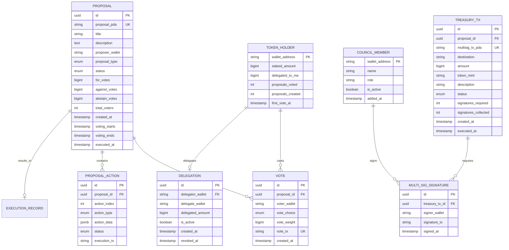

# HLD-CM-DAO-GOVERNANCE - Quản trị DAO & Tokenomics

> **Feature**: Hệ thống quản trị phi tập trung cho CryptoMeme.org
>
> **Service**: `cm-dao-governance` (Rust) + `cm-governance` (Solana Program)
>
> **Version**: 1.0 | **Last Updated**: 2025-01

---

## 📋 Mục lục

1. [Bối cảnh (Context)](#1-bối-cảnh-context)
2. [Context Diagram](#2-context-diagram)
3. [Core Business Workflows](#3-core-business-workflows)
4. [State Machine](#4-state-machine)
5. [Data Model](#5-data-model)
6. [Event Architecture](#6-event-architecture)
7. [API Contracts](#7-api-contracts)
8. [Integration Points](#8-integration-points)
9. [Non-Functional Requirements](#9-non-functional-requirements)
10. [Appendix](#10-appendix)

---

## 1. Bối cảnh (Context)

### 1.1 Bối cảnh Kinh doanh

**Vấn đề:**
- Các dự án crypto tập trung thiếu minh bạch và dễ bị lạm quyền
- Cộng đồng không có tiếng nói trong các quyết định quan trọng
- Treasury management thường không minh bạch
- Thiếu cơ chế incentive alignment giữa team và holders

**Giải pháp DAO Governance:**
- Quản trị phi tập trung qua $MEMEORG token
- Voting on-chain cho các quyết định quan trọng
- Multi-sig treasury với Squads Protocol
- Transparent proposal và execution process

**Giá trị mang lại:**
| Stakeholder | Giá trị |
|-------------|---------|
| Token Holders | Quyền vote, quyết định hướng đi của platform |
| Platform | Decentralization, community trust |
| Treasury | Quản lý minh bạch, multi-sig security |
| Contributors | Incentive alignment, fair compensation |

### 1.2 Bối cảnh Hệ thống

**DAO Governance** quản lý:

1. **Proposal System** - Tạo và vote proposals
2. **Voting Mechanism** - Token-weighted voting
3. **Treasury Management** - Multi-sig operations
4. **Parameter Updates** - Fee rates, thresholds
5. **Emergency Actions** - Pause, upgrade contracts

**Services liên quan:**
- `cm-dao-governance` (Rust) - Off-chain governance logic
- `cm-governance` (Solana Program) - On-chain voting
- Squads Protocol - Multi-sig treasury
- Realms SDK - Governance integration

### 1.3 Phạm vi Ngoài (Out of Scope)

| Phạm vi trong | Phạm vi ngoài |
|---------------|---------------|
| Proposal creation & voting | Legal entity formation |
| Treasury multi-sig | Fiat treasury management |
| Parameter governance | Smart contract upgrades |
| Vote delegation | Quadratic voting |
| On-chain execution | Complex time-locks |

### 1.4 Actors & Permissions

| Actor | Mô tả | Permissions |
|-------|-------|-------------|
| **Token Holder** | $MEMEORG holder | Vote, delegate, view |
| **Delegate** | Được ủy quyền vote | Vote với delegated tokens |
| **Proposer** | Người tạo proposal | Create proposals (min threshold) |
| **Council Member** | Multi-sig signer | Execute treasury operations |
| **Guardian** | Emergency role | Pause, veto malicious proposals |

---

## 2. Context Diagram


---

## 3. Core Business Workflows

### 3.1 Proposal Creation Flow


### 3.2 Voting Flow


### 3.3 Proposal Execution Flow


### 3.4 Vote Delegation Flow


---

## 4. State Machine

### 4.1 Proposal States


### 4.2 Treasury Transaction States


---

## 5. Data Model

### 5.1 Entity Relationship Diagram



### 5.2 Key Entities

| Entity | Mô tả | Storage |
|--------|-------|---------|
| `PROPOSAL` | Proposal metadata và status | PostgreSQL + Realms |
| `PROPOSAL_ACTION` | Actions to execute | PostgreSQL |
| `VOTE` | Individual votes | PostgreSQL + Realms |
| `TOKEN_HOLDER` | Holder voting stats | PostgreSQL |
| `DELEGATION` | Vote delegations | PostgreSQL + Realms |
| `TREASURY_TX` | Treasury transactions | PostgreSQL + Squads |
| `COUNCIL_MEMBER` | Multi-sig signers | PostgreSQL |

---

## 6. Event Architecture

### 6.1 Published Events

| Event | Trigger | Payload | Consumers |
|-------|---------|---------|-----------|
| `proposal.created` | New proposal | `{id, title, type, proposer}` | cm-notification |
| `proposal.vote_cast` | Vote recorded | `{proposal_id, voter, choice, weight}` | cm-analytics |
| `proposal.quorum_reached` | Quorum met | `{proposal_id, total_votes}` | cm-notification |
| `proposal.passed` | Majority yes | `{proposal_id, for_votes, against_votes}` | cm-notification |
| `proposal.rejected` | Majority no | `{proposal_id, reason}` | cm-notification |
| `proposal.executed` | Actions executed | `{proposal_id, actions[]}` | cm-notification |
| `treasury.tx_created` | New treasury TX | `{tx_id, amount, destination}` | cm-notification |
| `treasury.tx_executed` | TX executed | `{tx_id, tx_signature}` | cm-analytics |
| `vote.delegated` | Delegation changed | `{delegator, delegate, amount}` | cm-analytics |

### 6.2 Consumed Events

| Event | Source | Handler |
|-------|--------|---------|
| `staking.deposited` | cm-staking | Update vote power |
| `staking.withdrawn` | cm-staking | Update vote power |
| `fees.collected` | cm-swap | Update treasury balance |

---

## 7. API Contracts

### 7.1 GraphQL Schema

```graphql
# Types
type Proposal {
  id: ID!
  proposalPda: String!
  title: String!
  description: String!
  proposer: String!
  type: ProposalType!
  status: ProposalStatus!
  forVotes: String!
  againstVotes: String!
  abstainVotes: String!
  totalVoters: Int!
  quorumRequired: String!
  quorumReached: Boolean!
  approvalPercentage: Float!
  actions: [ProposalAction!]!
  myVote: Vote
  votingStarts: DateTime!
  votingEnds: DateTime!
  createdAt: DateTime!
  executedAt: DateTime
}

enum ProposalType {
  PARAMETER_CHANGE
  TREASURY_TRANSFER
  FEE_UPDATE
  COUNCIL_CHANGE
  EMERGENCY_ACTION
  GENERAL
}

enum ProposalStatus {
  DRAFT
  PENDING
  ACTIVE
  VOTING
  SUCCEEDED
  DEFEATED
  VETOED
  CANCELLED
  QUEUED
  EXECUTING
  EXECUTED
}

type ProposalAction {
  index: Int!
  type: ActionType!
  data: JSONObject!
  status: ActionStatus!
  executionTx: String
}

enum ActionType {
  TRANSFER_SOL
  TRANSFER_TOKEN
  UPDATE_PARAMETER
  ADD_COUNCIL_MEMBER
  REMOVE_COUNCIL_MEMBER
  PAUSE_CONTRACT
  RESUME_CONTRACT
}

type Vote {
  id: ID!
  voter: String!
  choice: VoteChoice!
  weight: String!
  txSignature: String!
  createdAt: DateTime!
}

enum VoteChoice {
  FOR
  AGAINST
  ABSTAIN
}

type TokenHolder {
  wallet: String!
  stakedAmount: String!
  delegatedToMe: String!
  totalVotePower: String!
  proposalsVoted: Int!
  proposalsCreated: Int!
  delegations: [Delegation!]!
}

type Delegation {
  id: ID!
  delegator: String!
  delegate: String!
  amount: String!
  isActive: Boolean!
  createdAt: DateTime!
}

type TreasuryStats {
  totalBalance: String!
  solBalance: String!
  memeorgBalance: String!
  pendingTransactions: Int!
  recentTransactions: [TreasuryTx!]!
}

type TreasuryTx {
  id: ID!
  proposal: Proposal
  destination: String!
  amount: String!
  tokenMint: String!
  description: String!
  status: TreasuryTxStatus!
  signaturesRequired: Int!
  signaturesCollected: Int!
  signatures: [MultiSigSignature!]!
  createdAt: DateTime!
  executedAt: DateTime
}

enum TreasuryTxStatus {
  CREATED
  PENDING_SIGNATURES
  THRESHOLD_MET
  EXECUTING
  EXECUTED
  FAILED
  EXPIRED
}

type MultiSigSignature {
  signer: CouncilMember!
  signedAt: DateTime!
}

type CouncilMember {
  wallet: String!
  name: String!
  role: String!
  isActive: Boolean!
}

# Queries
type Query {
  # Proposals
  proposal(id: ID!): Proposal
  proposals(
    status: ProposalStatus
    type: ProposalType
    first: Int = 20
    after: String
  ): ProposalConnection!

  activeProposals: [Proposal!]!
  myProposals: [Proposal!]!

  # Voting
  myVotePower: String!
  myVotes(first: Int = 20, after: String): VoteConnection!
  proposalVotes(proposalId: ID!, first: Int = 50): [Vote!]!

  # Delegation
  myDelegations: [Delegation!]!
  delegatorsToMe: [Delegation!]!

  # Treasury
  treasuryStats: TreasuryStats!
  treasuryTransactions(
    status: TreasuryTxStatus
    first: Int = 20
  ): [TreasuryTx!]!

  # Council
  councilMembers: [CouncilMember!]!

  # Governance params
  governanceParams: GovernanceParams!
}

type GovernanceParams {
  proposalThreshold: String!
  quorumPercentage: Float!
  votingPeriodDays: Int!
  timelockDays: Int!
  councilThreshold: Int!
}

# Mutations
type Mutation {
  # Proposals
  createProposal(input: CreateProposalInput!): Proposal!
  cancelProposal(proposalId: ID!): Boolean!

  # Voting
  castVote(input: CastVoteInput!): Vote!

  # Delegation
  delegateVotePower(
    delegateTo: String!
    signedTransaction: String!
  ): Delegation!

  revokeDelegation(delegationId: ID!): Boolean!

  # Council (requires council role)
  signTreasuryTx(
    txId: ID!
    signedTransaction: String!
  ): TreasuryTx!
}

input CreateProposalInput {
  title: String!
  description: String!
  type: ProposalType!
  actions: [ProposalActionInput!]!
  signedTransaction: String!
}

input ProposalActionInput {
  type: ActionType!
  data: JSONObject!
}

input CastVoteInput {
  proposalId: ID!
  choice: VoteChoice!
  signedTransaction: String!
}

# Subscriptions
type Subscription {
  proposalUpdated(proposalId: ID!): Proposal!
  newProposal: Proposal!
  treasuryTxUpdated(txId: ID!): TreasuryTx!
}
```

### 7.2 REST Endpoints

| Method | Endpoint | Mô tả |
|--------|----------|-------|
| `GET` | `/api/v1/proposals` | List proposals |
| `POST` | `/api/v1/proposals` | Create proposal |
| `GET` | `/api/v1/proposals/{id}` | Get proposal details |
| `POST` | `/api/v1/proposals/{id}/vote` | Cast vote |
| `GET` | `/api/v1/treasury` | Get treasury stats |
| `GET` | `/api/v1/treasury/transactions` | List treasury TXs |
| `POST` | `/api/v1/treasury/sign` | Sign treasury TX |
| `GET` | `/api/v1/governance/params` | Get governance params |

---

## 8. Integration Points

### 8.1 External Integrations

| System | Integration Type | Mục đích |
|--------|------------------|----------|
| **Realms SDK** | Solana SDK | On-chain governance |
| **Squads Protocol** | Solana SDK | Multi-sig treasury |
| **Helius RPC** | Solana RPC | Transaction submission |

### 8.2 Internal Service Dependencies


### 8.3 Data Flow Summary

| Source | Destination | Data | Protocol |
|--------|-------------|------|----------|
| cm-dao-governance | Realms | Proposals, Votes | Solana TX |
| cm-dao-governance | Squads | Treasury TXs | Solana TX |
| cm-dao-governance | cm-staking | Vote power queries | gRPC |
| cm-dao-governance | Kafka | Governance events | Kafka |

---

## 9. Non-Functional Requirements

### 9.1 Performance

| Metric | Target | Đo lường |
|--------|--------|----------|
| Vote submission | < 1 block (~400ms) | Solana confirmation |
| Proposal query | < 100ms | P95 latency |
| Vote power calculation | < 200ms | P95 latency |

### 9.2 Scalability

| Dimension | Target |
|-----------|--------|
| Active proposals | 100+ concurrent |
| Votes per proposal | 100,000+ |
| Token holders | 1,000,000+ |

### 9.3 Security

| Aspect | Requirement |
|--------|-------------|
| Vote integrity | On-chain verification |
| Treasury | Multi-sig (3/5) |
| Emergency | Guardian veto power |
| Timelocks | 48h for execution |

### 9.4 Availability

| Component | Target SLA |
|-----------|------------|
| Governance API | 99.9% |
| On-chain programs | 99.99% (Solana) |
| Vote recording | 99.9% |

---

## 10. Appendix

### 10.1 $MEMEORG Tokenomics

| Allocation | Percentage | Vesting |
|------------|------------|---------|
| Community/Airdrop | 40% | 6 months linear |
| Treasury | 25% | DAO controlled |
| Team | 15% | 2 year, 6 month cliff |
| Investors | 10% | 1 year, 3 month cliff |
| Liquidity | 5% | Immediate |
| Advisors | 5% | 1 year linear |

**Total Supply**: 1,000,000,000 $MEMEORG

### 10.2 Governance Thresholds

| Parameter | Value | Có thể sửa |
|-----------|-------|------------|
| Proposal Threshold | 100,000 $MEMEORG (0.01%) | Yes (via proposal) |
| Quorum | 4% of circulating supply | Yes |
| Approval Threshold | 50% + 1 vote | Yes |
| Voting Period | 5 days | Yes |
| Timelock | 48 hours | Yes |
| Emergency Timelock | 6 hours | No |

### 10.3 Council Configuration

| Role | Count | Responsibility |
|------|-------|----------------|
| Core Team | 2 | Protocol development |
| Community Elected | 2 | Community representation |
| Advisor | 1 | External oversight |

**Threshold**: 3/5 signatures required

### 10.4 Proposal Types & Requirements

| Type | Min Stake | Voting Period | Timelock |
|------|-----------|---------------|----------|
| Parameter Change | 100K | 5 days | 48h |
| Treasury < 10K SOL | 100K | 5 days | 48h |
| Treasury >= 10K SOL | 500K | 7 days | 72h |
| Council Change | 500K | 7 days | 72h |
| Emergency | Guardian only | 24h | 6h |

### 10.5 Related Documents

- [HLD-CM-PROOF-OF-CULTURE.md](../Core/HLD-CM-PROOF-OF-CULTURE.md) - Staking integration
- [Tech-Stack.md](../../../Design/Tech-Stack.md) - Technology stack
- [COMPLIANCE-REQUIREMENTS.md](../../COMPLIANCE-REQUIREMENTS.md) - Legal compliance
