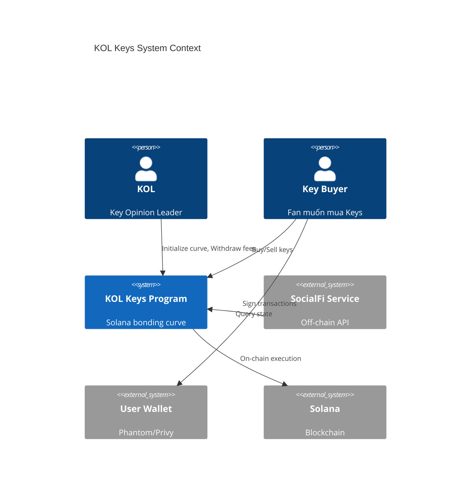
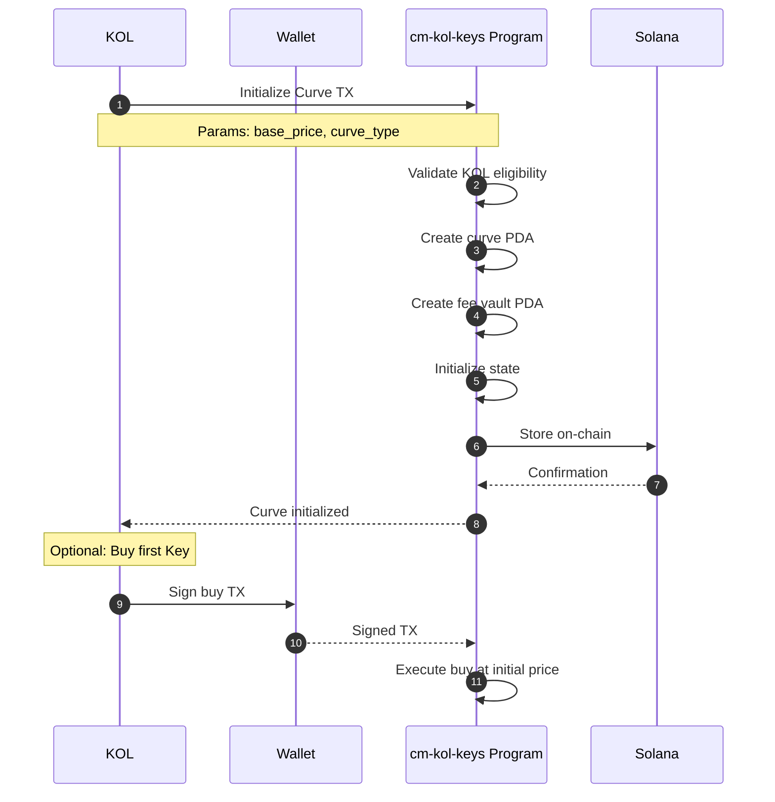
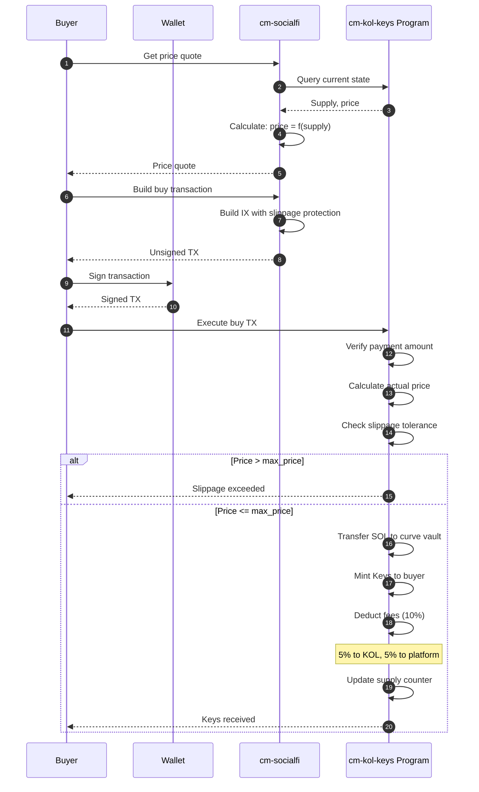
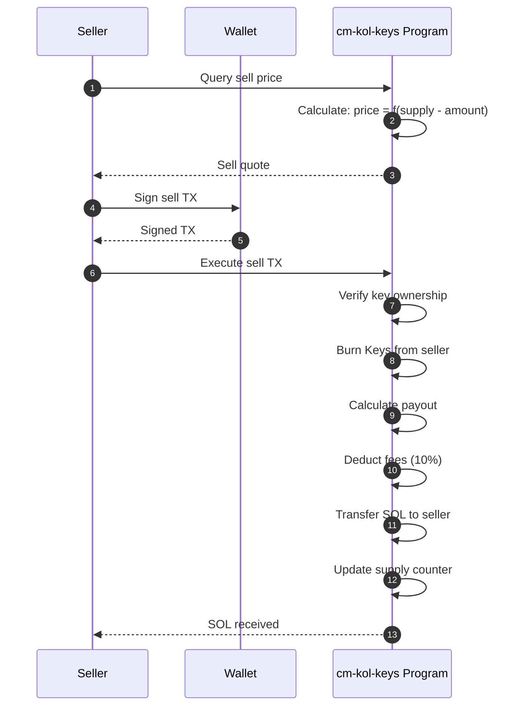
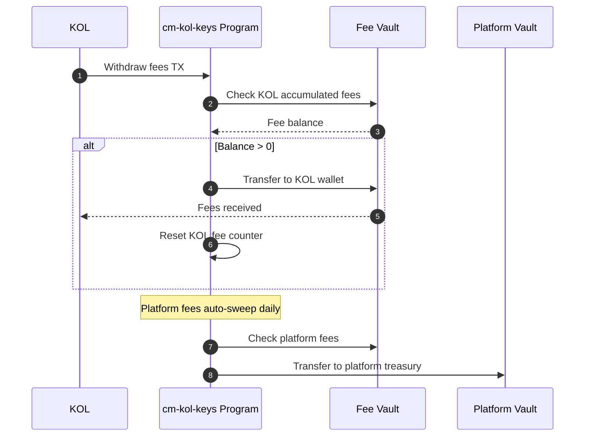
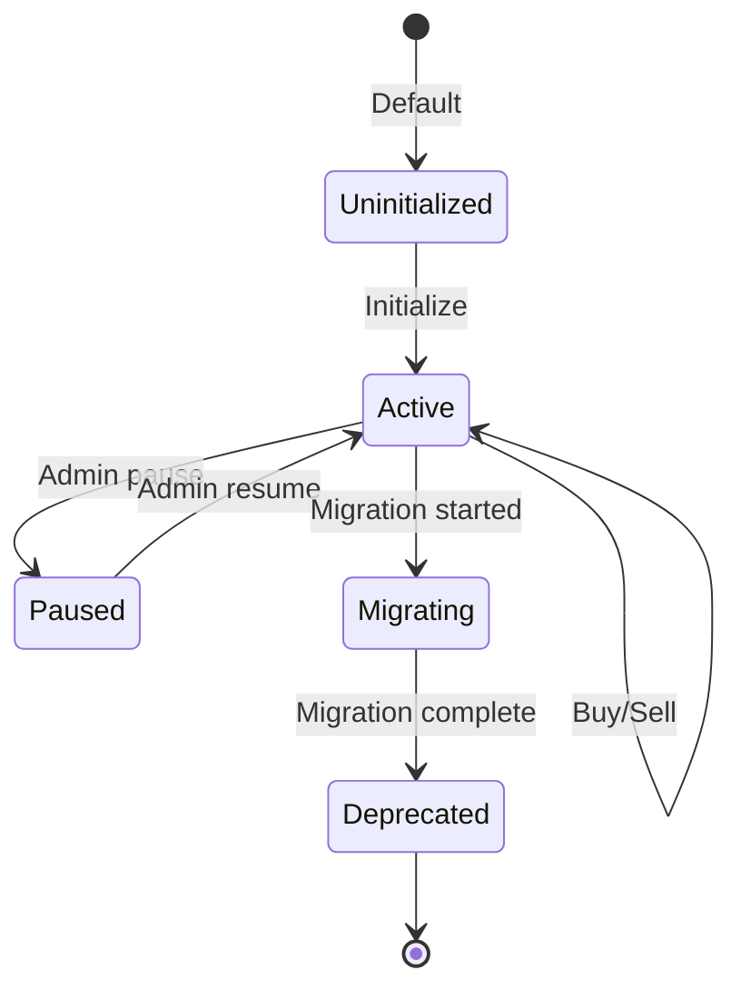
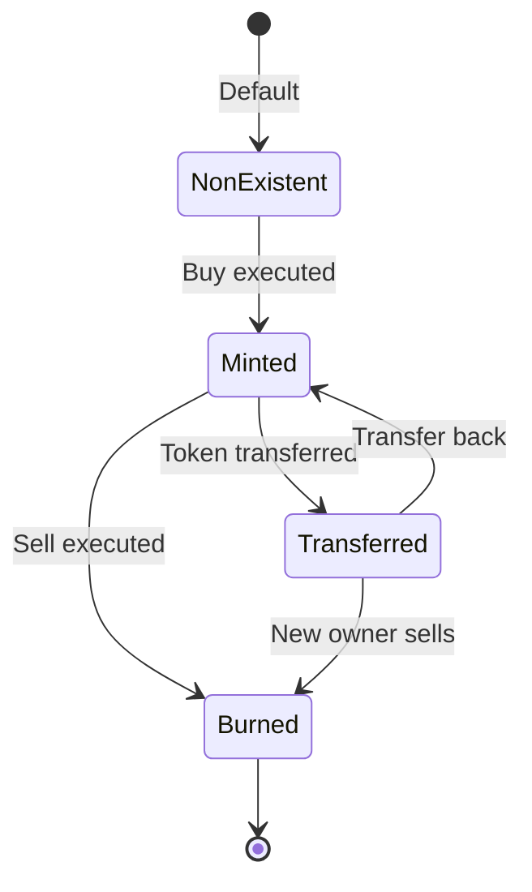
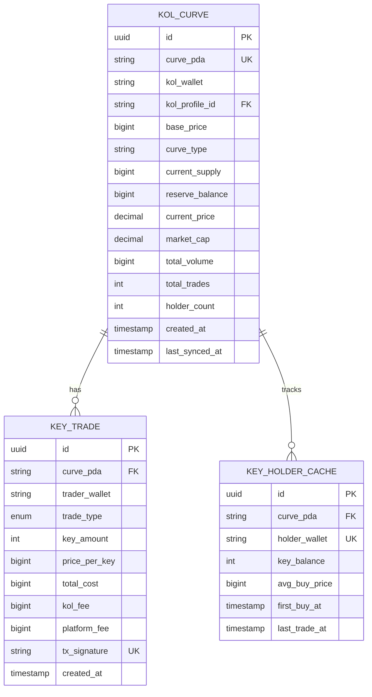
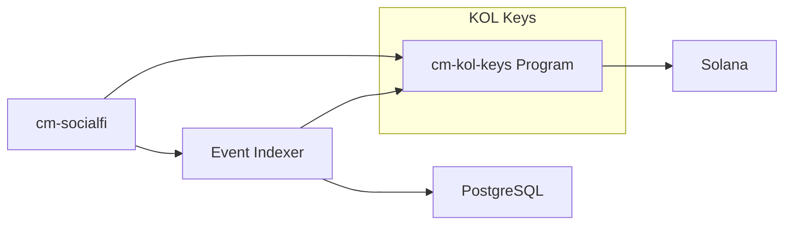

# HLD-CM-KOL-KEYS - Bonding Curve cho KOL Keys

> **Feature**: Hệ thống bonding curve cho KOL Keys trading
>
> **Service**: `cm-kol-keys` (Solana Program - Anchor)
>
> **Version**: 1.0 | **Last Updated**: 2025-01

---

## 📋 Mục lục

1. [Bối cảnh (Context)](#1-bối-cảnh-context)
2. [Context Diagram](#2-context-diagram)
3. [Core Business Workflows](#3-core-business-workflows)
4. [State Machine](#4-state-machine)
5. [Data Model](#5-data-model)
6. [Bonding Curve Mathematics](#6-bonding-curve-mathematics)
7. [API Contracts](#7-api-contracts)
8. [Integration Points](#8-integration-points)
9. [Non-Functional Requirements](#9-non-functional-requirements)
10. [Appendix](#10-appendix)

---

## 1. Bối cảnh (Context)

### 1.1 Bối cảnh Kinh doanh

**Vấn đề:**
- KOLs thiếu cơ chế monetize influence trực tiếp
- Fans không có cách đầu tư vào KOL yêu thích
- Mối quan hệ KOL-fan không có economic skin-in-the-game
- Traditional subscription model không có upside potential

**Giải pháp KOL Keys:**
- Mỗi KOL có bonding curve riêng phát hành "Keys"
- Giá Key tăng theo supply (bonding curve)
- Key holders được access exclusive content
- Fees từ trading chia sẻ giữa KOL và platform

**Giá trị mang lại:**
| Stakeholder | Giá trị |
|-------------|---------|
| KOLs | Passive income từ trading fees |
| Key Holders | Exclusive access + investment upside |
| Early Buyers | Giá rẻ hơn, potential profit |
| Platform | Revenue từ platform fees |

### 1.2 Bối cảnh Hệ thống

**KOL Keys** là Solana Program quản lý:

1. **Bonding Curve** - Pricing mechanism
2. **Key Minting** - Phát hành keys khi buy
3. **Key Burning** - Burn keys khi sell
4. **Fee Distribution** - Chia fees cho KOL và platform
5. **Access Control** - Verify key ownership

**Components:**
- `cm-kol-keys` (Solana Program) - On-chain logic
- `cm-socialfi` (Rust/Actix) - Off-chain API
- User Wallet - Signing transactions

### 1.3 Phạm vi Ngoài (Out of Scope)

| Phạm vi trong | Phạm vi ngoài |
|---------------|---------------|
| Bonding curve math | Complex curve types |
| Buy/Sell mechanics | Limit orders |
| Fee distribution | Referral system |
| Basic access control | Tiered content system |

### 1.4 Actors & Permissions

| Actor | Mô tả | Permissions |
|-------|-------|-------------|
| **KOL** | Key Opinion Leader | Initialize curve, withdraw fees |
| **Buyer** | Người mua Keys | Buy, sell keys |
| **Holder** | Người sở hữu Keys | Access content, sell |
| **Program Authority** | DAO multi-sig | Update global params |

---

## 2. Context Diagram



---

## 3. Core Business Workflows

### 3.1 Initialize Bonding Curve Flow



### 3.2 Buy Keys Flow



### 3.3 Sell Keys Flow



### 3.4 Fee Withdrawal Flow



---

## 4. State Machine

### 4.1 Bonding Curve States



### 4.2 Key Token States



---

## 5. Data Model

### 5.1 On-Chain Account Structure

```rust
/// Main bonding curve state account
#[account]
pub struct BondingCurve {
    /// Curve authority (KOL wallet)
    pub authority: Pubkey,          // 32 bytes

    /// Curve parameters
    pub base_price: u64,            // 8 bytes (lamports)
    pub curve_type: CurveType,      // 1 byte
    pub divisor: u64,               // 8 bytes

    /// Current state
    pub total_supply: u64,          // 8 bytes
    pub reserve_balance: u64,       // 8 bytes (SOL in curve)

    /// Fee configuration
    pub kol_fee_bps: u16,           // 2 bytes (basis points)
    pub platform_fee_bps: u16,      // 2 bytes

    /// Fee accumulation
    pub kol_fees_accumulated: u64,  // 8 bytes
    pub platform_fees_accumulated: u64, // 8 bytes

    /// Status
    pub status: CurveStatus,        // 1 byte
    pub bump: u8,                   // 1 byte

    /// Timestamps
    pub created_at: i64,            // 8 bytes
    pub last_trade_at: i64,         // 8 bytes
}

#[derive(AnchorSerialize, AnchorDeserialize, Clone, Copy)]
pub enum CurveType {
    /// price = base_price * (supply^2 / divisor)
    Quadratic,

    /// price = base_price * (supply^1.5 / divisor)
    SubQuadratic,

    /// price = base_price * e^(supply * k / divisor)
    Exponential,
}

#[derive(AnchorSerialize, AnchorDeserialize, Clone, Copy)]
pub enum CurveStatus {
    Active,
    Paused,
    Migrating,
    Deprecated,
}

/// Key holder account (PDA per user per curve)
#[account]
pub struct KeyHolder {
    /// Owner wallet
    pub owner: Pubkey,              // 32 bytes

    /// Associated curve
    pub curve: Pubkey,              // 32 bytes

    /// Key balance
    pub key_balance: u64,           // 8 bytes

    /// Trading stats
    pub total_bought: u64,          // 8 bytes
    pub total_sold: u64,            // 8 bytes
    pub total_spent: u64,           // 8 bytes (lamports)
    pub total_received: u64,        // 8 bytes (lamports)

    /// Timestamps
    pub first_buy_at: i64,          // 8 bytes
    pub last_trade_at: i64,         // 8 bytes

    pub bump: u8,                   // 1 byte
}

/// Global program config
#[account]
pub struct GlobalConfig {
    /// Program authority (DAO multi-sig)
    pub authority: Pubkey,          // 32 bytes

    /// Default fee settings
    pub default_kol_fee_bps: u16,   // 2 bytes
    pub default_platform_fee_bps: u16, // 2 bytes

    /// Platform fee destination
    pub platform_vault: Pubkey,     // 32 bytes

    /// Constraints
    pub min_base_price: u64,        // 8 bytes
    pub max_base_price: u64,        // 8 bytes

    pub bump: u8,                   // 1 byte
}
```

### 5.2 Off-Chain Data (PostgreSQL)



---

## 6. Bonding Curve Mathematics

### 6.1 Pricing Formula

**Quadratic Curve (Default):**
```
price(supply) = base_price * (supply² / divisor)
```

**Parameters:**
- `base_price`: 1,000,000 lamports (0.001 SOL)
- `divisor`: 16,000

**Example Prices:**
| Supply | Calculation | Price (SOL) |
|--------|-------------|-------------|
| 1 | 0.001 * (1/16000) | 0.0000000625 |
| 10 | 0.001 * (100/16000) | 0.00000625 |
| 50 | 0.001 * (2500/16000) | 0.00015625 |
| 100 | 0.001 * (10000/16000) | 0.000625 |
| 200 | 0.001 * (40000/16000) | 0.0025 |
| 500 | 0.001 * (250000/16000) | 0.015625 |
| 1000 | 0.001 * (1000000/16000) | 0.0625 |

### 6.2 Buy Cost Calculation

Để mua `n` keys khi supply hiện tại là `s`:

```
cost = integral from s to (s+n) of price(x) dx
     = base_price * (sum of x² from s to s+n-1) / divisor
     = base_price * [(s+n-1)(s+n)(2s+2n-1)/6 - (s-1)(s)(2s-1)/6] / divisor
```

**Simplified approximation:**
```
cost ≈ base_price * n * avg_price
where avg_price = price((2s + n) / 2)
```

### 6.3 Sell Return Calculation

Để bán `n` keys khi supply hiện tại là `s`:

```
return = integral from (s-n) to s of price(x) dx
       = (same formula as buy, but from s-n to s-1)
```

### 6.4 Fee Structure

```
total_fee_bps = kol_fee_bps + platform_fee_bps
              = 500 + 500
              = 1000 bps (10%)

For a trade of value V:
- Buyer pays: V * (1 + total_fee_bps/10000)
- Seller receives: V * (1 - total_fee_bps/10000)
- KOL receives: V * kol_fee_bps / 10000
- Platform receives: V * platform_fee_bps / 10000
```

### 6.5 Market Cap Calculation

```
market_cap = sum of all key values at current price
           = total_supply * current_price
           = total_supply * base_price * (total_supply² / divisor)
           = base_price * total_supply³ / divisor
```

---

## 7. API Contracts

### 7.1 Solana Program Instructions

```rust
#[program]
pub mod kol_keys {
    use super::*;

    /// Initialize global config (one-time, by deployer)
    pub fn initialize_config(
        ctx: Context<InitializeConfig>,
        default_kol_fee_bps: u16,
        default_platform_fee_bps: u16,
        platform_vault: Pubkey,
    ) -> Result<()>;

    /// Create a new bonding curve for a KOL
    pub fn initialize_curve(
        ctx: Context<InitializeCurve>,
        base_price: u64,
        curve_type: CurveType,
        divisor: u64,
    ) -> Result<()>;

    /// Buy keys from bonding curve
    pub fn buy_keys(
        ctx: Context<BuyKeys>,
        amount: u64,           // Number of keys to buy
        max_cost: u64,         // Max lamports willing to pay (slippage)
    ) -> Result<()>;

    /// Sell keys back to curve
    pub fn sell_keys(
        ctx: Context<SellKeys>,
        amount: u64,           // Number of keys to sell
        min_return: u64,       // Min lamports to receive (slippage)
    ) -> Result<()>;

    /// KOL withdraws accumulated fees
    pub fn withdraw_kol_fees(
        ctx: Context<WithdrawKolFees>,
    ) -> Result<()>;

    /// Platform withdraws accumulated fees (authority only)
    pub fn withdraw_platform_fees(
        ctx: Context<WithdrawPlatformFees>,
    ) -> Result<()>;

    /// Pause/Resume curve (authority only)
    pub fn set_curve_status(
        ctx: Context<SetCurveStatus>,
        new_status: CurveStatus,
    ) -> Result<()>;

    /// Update global config (authority only)
    pub fn update_config(
        ctx: Context<UpdateConfig>,
        new_kol_fee_bps: Option<u16>,
        new_platform_fee_bps: Option<u16>,
    ) -> Result<()>;
}
```

### 7.2 Account Contexts

```rust
#[derive(Accounts)]
pub struct InitializeCurve<'info> {
    #[account(mut)]
    pub kol: Signer<'info>,

    #[account(
        init,
        payer = kol,
        space = 8 + BondingCurve::INIT_SPACE,
        seeds = [b"curve", kol.key().as_ref()],
        bump
    )]
    pub curve: Account<'info, BondingCurve>,

    #[account(
        seeds = [b"config"],
        bump = config.bump
    )]
    pub config: Account<'info, GlobalConfig>,

    pub system_program: Program<'info, System>,
}

#[derive(Accounts)]
pub struct BuyKeys<'info> {
    #[account(mut)]
    pub buyer: Signer<'info>,

    #[account(
        mut,
        seeds = [b"curve", curve.authority.as_ref()],
        bump = curve.bump,
        constraint = curve.status == CurveStatus::Active
    )]
    pub curve: Account<'info, BondingCurve>,

    #[account(
        init_if_needed,
        payer = buyer,
        space = 8 + KeyHolder::INIT_SPACE,
        seeds = [b"holder", curve.key().as_ref(), buyer.key().as_ref()],
        bump
    )]
    pub holder: Account<'info, KeyHolder>,

    pub system_program: Program<'info, System>,
}

#[derive(Accounts)]
pub struct SellKeys<'info> {
    #[account(mut)]
    pub seller: Signer<'info>,

    #[account(
        mut,
        seeds = [b"curve", curve.authority.as_ref()],
        bump = curve.bump,
        constraint = curve.status == CurveStatus::Active
    )]
    pub curve: Account<'info, BondingCurve>,

    #[account(
        mut,
        seeds = [b"holder", curve.key().as_ref(), seller.key().as_ref()],
        bump = holder.bump,
        constraint = holder.key_balance >= amount
    )]
    pub holder: Account<'info, KeyHolder>,

    pub system_program: Program<'info, System>,
}
```

### 7.3 Events

```rust
#[event]
pub struct CurveInitialized {
    pub curve: Pubkey,
    pub kol: Pubkey,
    pub base_price: u64,
    pub curve_type: CurveType,
    pub timestamp: i64,
}

#[event]
pub struct KeysBought {
    pub curve: Pubkey,
    pub buyer: Pubkey,
    pub amount: u64,
    pub cost: u64,
    pub new_supply: u64,
    pub new_price: u64,
    pub kol_fee: u64,
    pub platform_fee: u64,
    pub timestamp: i64,
}

#[event]
pub struct KeysSold {
    pub curve: Pubkey,
    pub seller: Pubkey,
    pub amount: u64,
    pub return_amount: u64,
    pub new_supply: u64,
    pub new_price: u64,
    pub kol_fee: u64,
    pub platform_fee: u64,
    pub timestamp: i64,
}

#[event]
pub struct FeesWithdrawn {
    pub curve: Pubkey,
    pub recipient: Pubkey,
    pub amount: u64,
    pub fee_type: FeeType,
    pub timestamp: i64,
}
```

---

## 8. Integration Points

### 8.1 External Integrations

| System | Integration Type | Mục đích |
|--------|------------------|----------|
| **Helius RPC** | Solana RPC | Transaction submission |
| **Helius Webhooks** | Webhooks | Event indexing |
| **Privy** | SDK | Wallet signing |

### 8.2 Internal Service Dependencies



### 8.3 Data Flow Summary

| Source | Destination | Data | Protocol |
|--------|-------------|------|----------|
| cm-socialfi | cm-kol-keys | Buy/Sell TXs | Solana TX |
| cm-kol-keys | Helius | Events | Webhooks |
| Indexer | PostgreSQL | Trade history | SQL |
| cm-socialfi | cm-kol-keys | State queries | RPC |

---

## 9. Non-Functional Requirements

### 9.1 Performance

| Metric | Target | Đo lường |
|--------|--------|----------|
| Buy/Sell execution | < 1 block (~400ms) | Solana confirmation |
| Price quote | < 50ms | RPC query time |
| Event indexing | < 5s | Webhook to DB |

### 9.2 Scalability

| Dimension | Target |
|-----------|--------|
| Active curves | 10,000+ |
| Trades per second | 100+ TPS |
| Total keys outstanding | 10M+ |

### 9.3 Security

| Aspect | Requirement |
|--------|-------------|
| Slippage protection | Required for all trades |
| Overflow prevention | Checked math operations |
| Authority validation | PDA-based access control |
| Pause mechanism | Emergency circuit breaker |

### 9.4 Availability

| Component | Target SLA |
|-----------|------------|
| Solana Program | 99.99% (network dependent) |
| Off-chain API | 99.9% |
| Event indexing | 99.5% |

---

## 10. Appendix

### 10.1 Default Configuration

| Parameter | Value | Mô tả |
|-----------|-------|-------|
| `base_price` | 1,000,000 lamports | 0.001 SOL |
| `divisor` | 16,000 | Curve steepness |
| `curve_type` | Quadratic | Default curve |
| `kol_fee_bps` | 500 | 5% to KOL |
| `platform_fee_bps` | 500 | 5% to platform |

### 10.2 Price Table (Quadratic, default params)

| Supply | Price (SOL) | Market Cap (SOL) |
|--------|-------------|------------------|
| 10 | 0.00000625 | 0.0000625 |
| 50 | 0.00015625 | 0.0078125 |
| 100 | 0.000625 | 0.0625 |
| 200 | 0.0025 | 0.5 |
| 500 | 0.015625 | 7.8125 |
| 1000 | 0.0625 | 62.5 |
| 2000 | 0.25 | 500 |
| 5000 | 1.5625 | 7,812.5 |

### 10.3 Error Codes

| Code | Description |
|------|-------------|
| `InsufficientFunds` | Not enough SOL for purchase |
| `SlippageExceeded` | Price moved beyond tolerance |
| `InsufficientKeys` | Not enough keys to sell |
| `CurvePaused` | Trading temporarily disabled |
| `Unauthorized` | Invalid signer |
| `InvalidAmount` | Amount must be > 0 |
| `MathOverflow` | Calculation overflow |

### 10.4 Comparison with friend.tech

| Aspect | friend.tech | CryptoMeme KOL Keys |
|--------|-------------|---------------------|
| Chain | Base (L2) | Solana |
| Curve | price = supply²/16000 | Configurable |
| Fees | 10% (5%/5%) | 10% (5%/5%) default |
| Access | Chat rooms | Exclusive content |
| Portability | Locked | Transferable tokens |

### 10.5 Related Documents

- [HLD-CM-SOCIALFI.md](../Core/HLD-CM-SOCIALFI.md) - SocialFi integration
- [Tech-Stack.md](../../../Design/Tech-Stack.md) - Technology stack
