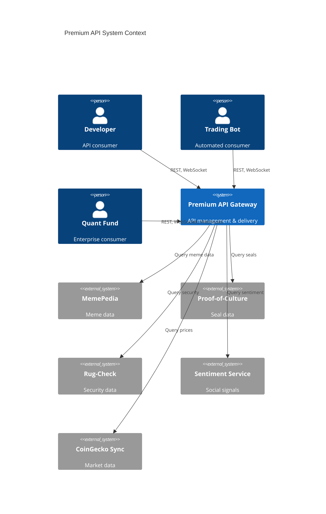
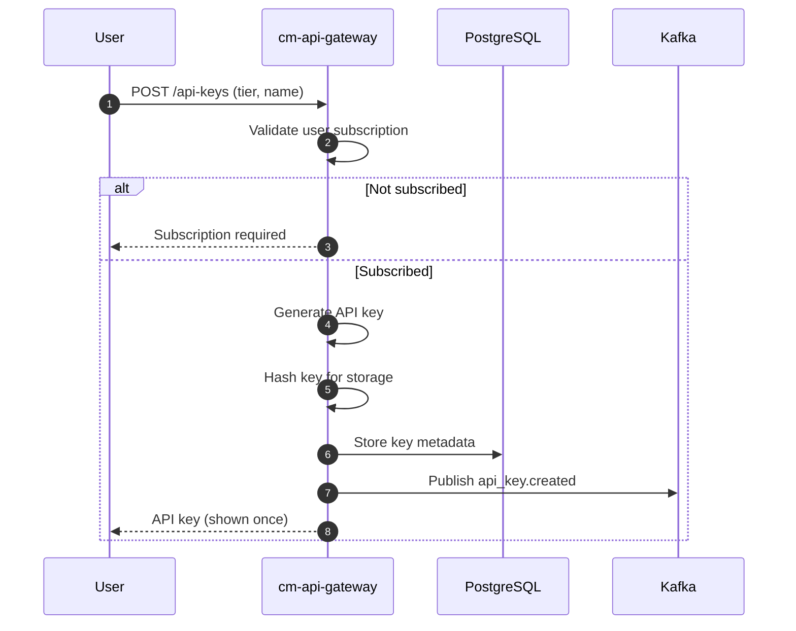
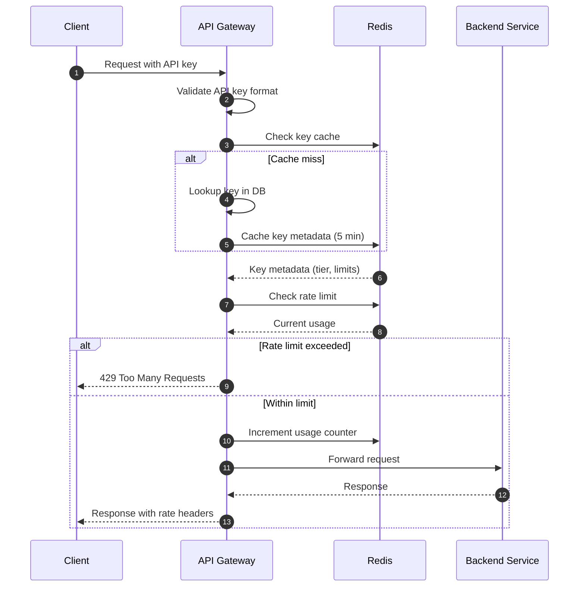
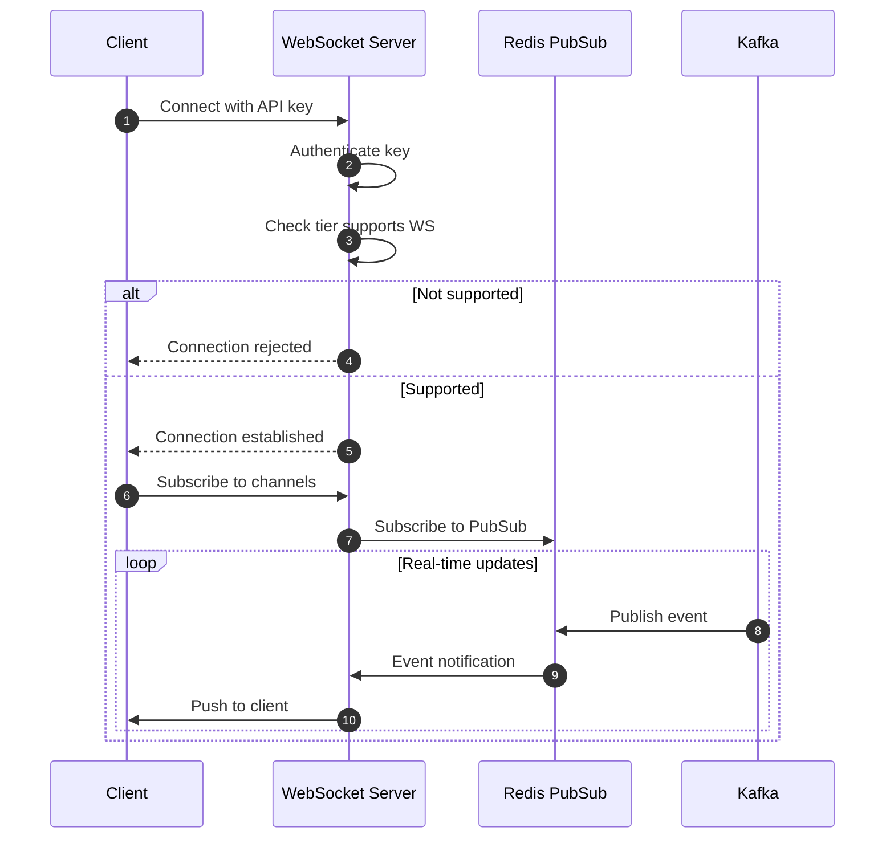
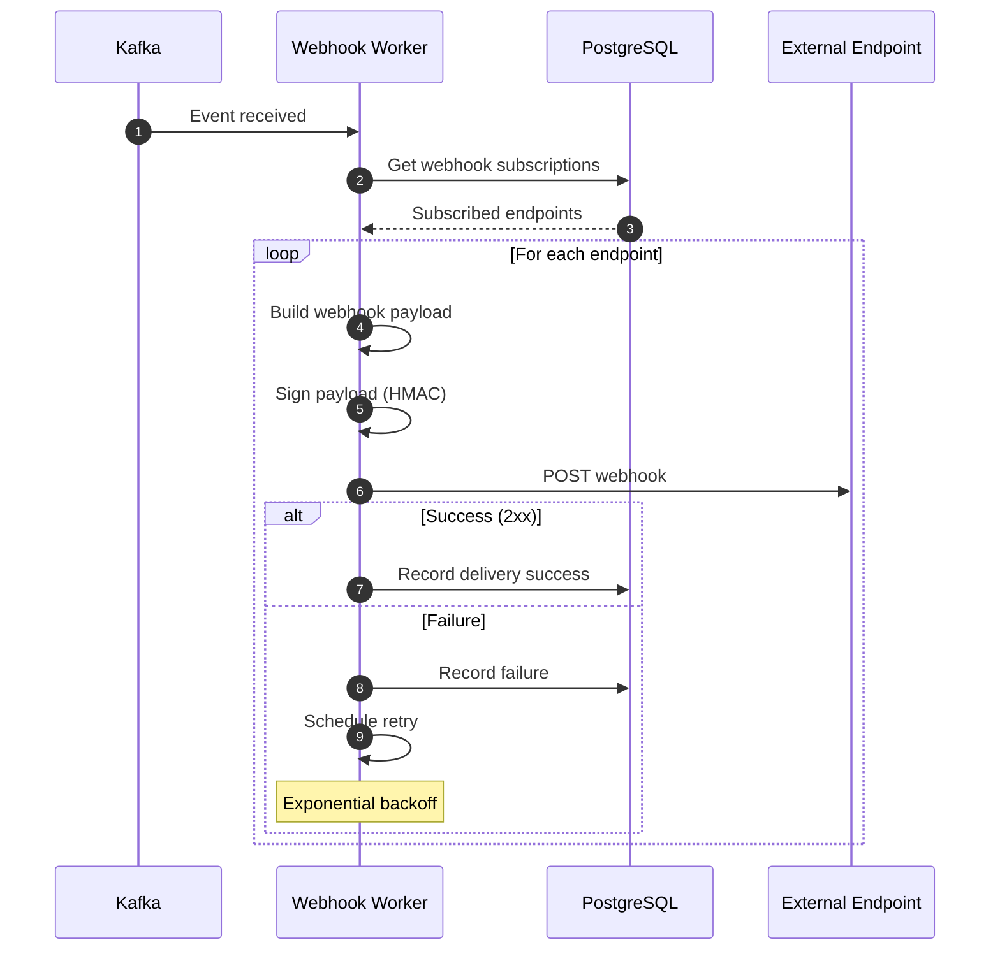
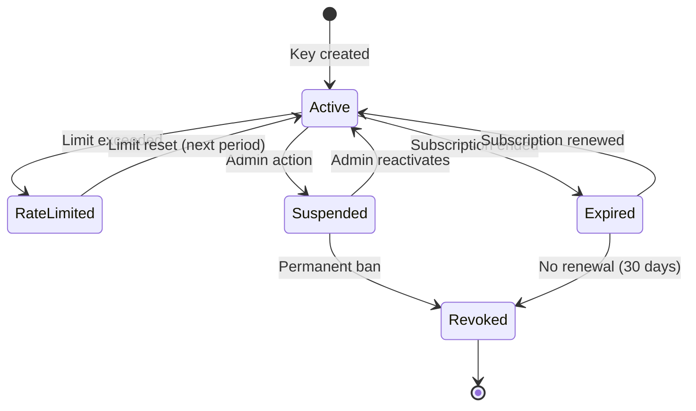
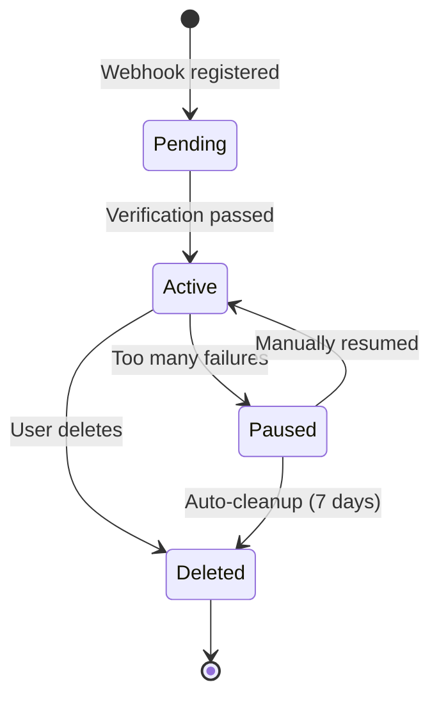
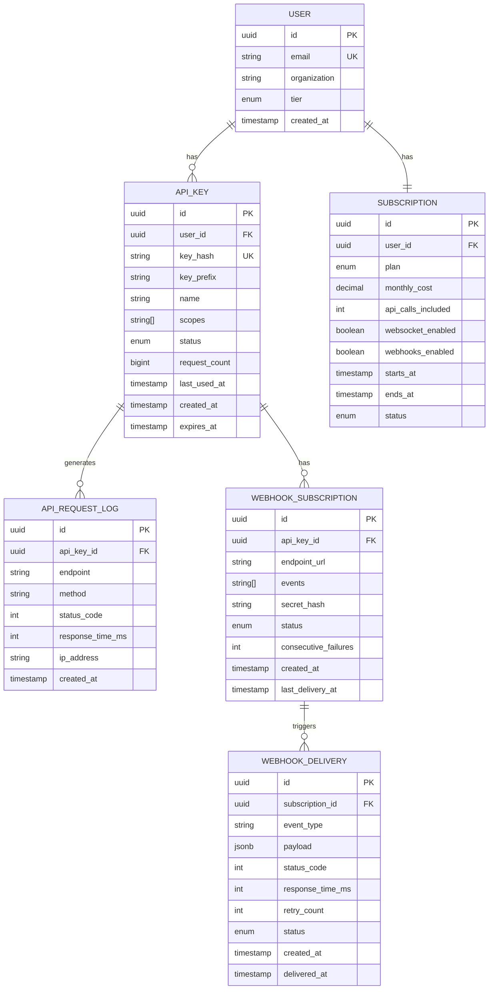
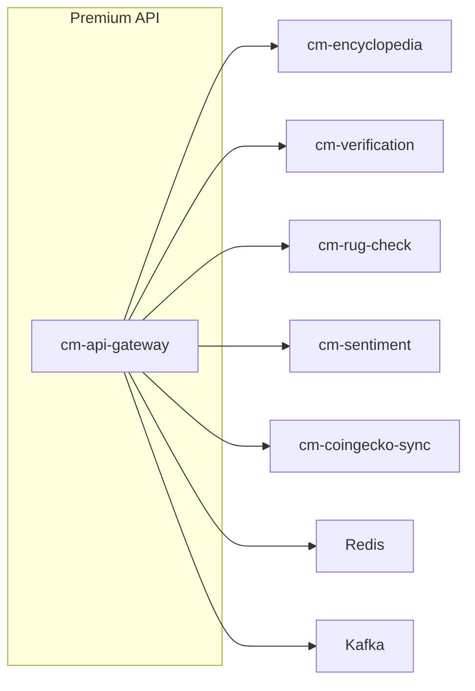

# HLD-CM-PREMIUM-API - API Dữ liệu Cao cấp

> **Feature**: API trả phí cho quỹ đầu cơ, bots, và developers
>
> **Service**: `cm-api-gateway` (Node.js/Fastify)
>
> **Version**: 1.0 | **Last Updated**: 2025-01

---

## 📋 Mục lục

1. [Bối cảnh (Context)](#1-bối-cảnh-context)
2. [Context Diagram](#2-context-diagram)
3. [Core Business Workflows](#3-core-business-workflows)
4. [State Machine](#4-state-machine)
5. [Data Model](#5-data-model)
6. [API Tiers & Pricing](#6-api-tiers--pricing)
7. [API Contracts](#7-api-contracts)
8. [Integration Points](#8-integration-points)
9. [Non-Functional Requirements](#9-non-functional-requirements)
10. [Appendix](#10-appendix)

---

## 1. Bối cảnh (Context)

### 1.1 Bối cảnh Kinh doanh

**Vấn đề:**
- Quỹ đầu cơ và trading bots cần dữ liệu real-time chất lượng cao
- Không có API cung cấp cả cultural context và market data
- Developers thiếu công cụ xây dựng ứng dụng meme coin
- Revenue stream cần đa dạng hóa ngoài trading fees

**Giải pháp Premium API:**
- Tiered API plans cho các use cases khác nhau
- Real-time data via REST và WebSocket
- Webhook notifications cho events quan trọng
- Comprehensive documentation và SDKs

**Giá trị mang lại:**
| Stakeholder | Giá trị |
|-------------|---------|
| Quỹ đầu cơ | Dữ liệu alpha, sentiment signals |
| Trading Bots | Real-time feeds, low latency |
| Developers | Easy integration, SDKs |
| Platform | Recurring revenue, B2B relationships |

### 1.2 Bối cảnh Hệ thống

**Premium API** cung cấp:

1. **REST API** - Synchronized data queries
2. **WebSocket API** - Real-time streaming
3. **Webhooks** - Event notifications
4. **Rate Limiting** - Tier-based throttling
5. **API Key Management** - Authentication & billing

**Services liên quan:**
- `cm-api-gateway` (Node.js/Fastify) - API gateway
- `cm-encyclopedia` (Rust) - Meme data source
- `cm-verification` (Rust) - Culture seal data
- `cm-rug-check` (Node.js) - Security data
- Redis - Rate limiting, caching

### 1.3 Phạm vi Ngoài (Out of Scope)

| Phạm vi trong | Phạm vi ngoài |
|---------------|---------------|
| Data API endpoints | Trading execution |
| Rate limiting | Billing/payments |
| API key management | Customer support portal |
| Webhooks | Custom data pipelines |
| Basic SDKs | Enterprise integrations |

### 1.4 Actors & Permissions

| Actor | Mô tả | Permissions |
|-------|-------|-------------|
| **Free User** | Basic access | Limited endpoints, low rate |
| **Developer** | Paid tier | Full endpoints, moderate rate |
| **Professional** | Higher tier | Priority, webhooks |
| **Enterprise** | Custom tier | Unlimited, dedicated support |
| **Admin** | Platform operator | Manage keys, view metrics |

---

## 2. Context Diagram



---

## 3. Core Business Workflows

### 3.1 API Key Provisioning Flow



### 3.2 Request Authentication & Rate Limiting



### 3.3 WebSocket Subscription Flow



### 3.4 Webhook Delivery Flow



---

## 4. State Machine

### 4.1 API Key States



### 4.2 Webhook Subscription States



---

## 5. Data Model

### 5.1 Entity Relationship Diagram



### 5.2 Key Entities

| Entity | Mô tả | Storage |
|--------|-------|---------|
| `USER` | API user account | PostgreSQL |
| `SUBSCRIPTION` | User subscription details | PostgreSQL |
| `API_KEY` | API key metadata | PostgreSQL + Redis |
| `API_REQUEST_LOG` | Request audit log | PostgreSQL (partitioned) |
| `WEBHOOK_SUBSCRIPTION` | Webhook endpoints | PostgreSQL |
| `WEBHOOK_DELIVERY` | Delivery attempts | PostgreSQL |

---

## 6. API Tiers & Pricing

### 6.1 Tier Comparison

| Feature | Free | Developer | Professional | Enterprise |
|---------|------|-----------|--------------|------------|
| **Monthly Price** | $0 | $49 | $299 | Custom |
| **API Calls/month** | 1,000 | 50,000 | 500,000 | Unlimited |
| **Rate Limit** | 10/min | 100/min | 1,000/min | 10,000/min |
| **WebSocket** | No | Yes (5 channels) | Yes (50 channels) | Yes (unlimited) |
| **Webhooks** | No | No | Yes (10 endpoints) | Yes (unlimited) |
| **Historical Data** | 7 days | 30 days | 1 year | Full history |
| **Endpoints** | Basic | Full | Full + Premium | All + Custom |
| **Support** | Community | Email | Priority | Dedicated |
| **SLA** | None | 99.5% | 99.9% | 99.99% |

### 6.2 Endpoint Access by Tier

| Endpoint Category | Free | Developer | Professional | Enterprise |
|-------------------|------|-----------|--------------|------------|
| `/memes` (basic) | Yes | Yes | Yes | Yes |
| `/memes` (full) | No | Yes | Yes | Yes |
| `/tokens/price` | Yes | Yes | Yes | Yes |
| `/tokens/security` | No | Yes | Yes | Yes |
| `/verification/seals` | No | Yes | Yes | Yes |
| `/sentiment` | No | No | Yes | Yes |
| `/analytics/advanced` | No | No | Yes | Yes |
| `/bulk` operations | No | No | Yes | Yes |
| Custom endpoints | No | No | No | Yes |

### 6.3 Rate Limit Details

| Tier | Requests/min | Burst | Daily Cap |
|------|--------------|-------|-----------|
| Free | 10 | 20 | 1,000 |
| Developer | 100 | 200 | 50,000 |
| Professional | 1,000 | 2,000 | 500,000 |
| Enterprise | 10,000 | 20,000 | None |

---

## 7. API Contracts

### 7.1 REST API Endpoints

#### Meme Data

```yaml
GET /v1/memes
  description: List memes with filtering
  parameters:
    - search: string (optional)
    - category: string (optional)
    - verified_only: boolean (optional)
    - sort: string (popularity|recent|market_cap)
    - page: integer
    - limit: integer (max 100)
  response: PaginatedMemeList

GET /v1/memes/{id}
  description: Get meme details
  response: MemeDetail

GET /v1/memes/{id}/genealogy
  description: Get meme family tree
  tier: Developer+
  response: GenealogyGraph

GET /v1/memes/{id}/wiki
  description: Get wiki content
  response: WikiContent
```

#### Token Data

```yaml
GET /v1/tokens/{mint}
  description: Get token details
  response: TokenDetail

GET /v1/tokens/{mint}/price
  description: Get current price
  response: TokenPrice

GET /v1/tokens/{mint}/history
  description: Get price history
  tier: Developer+
  parameters:
    - interval: string (1m|5m|1h|1d)
    - from: timestamp
    - to: timestamp
  response: PriceHistory

GET /v1/tokens/{mint}/security
  description: Get security score
  tier: Developer+
  response: SecurityReport

GET /v1/tokens/{mint}/holders
  description: Get holder distribution
  tier: Professional+
  response: HolderAnalysis
```

#### Verification Data

```yaml
GET /v1/seals
  description: List culture seals
  tier: Developer+
  response: PaginatedSealList

GET /v1/seals/{meme_id}
  description: Get seal details
  tier: Developer+
  response: CultureSeal

GET /v1/verifications/pending
  description: List pending verifications
  tier: Professional+
  response: PaginatedVerificationList
```

#### Sentiment Data

```yaml
GET /v1/sentiment/{token}
  description: Get sentiment signals
  tier: Professional+
  response: SentimentReport

GET /v1/sentiment/trending
  description: Get trending tokens by sentiment
  tier: Professional+
  response: TrendingList
```

#### Bulk Operations

```yaml
POST /v1/bulk/tokens
  description: Get multiple tokens
  tier: Professional+
  body: { mints: string[] }
  response: TokenDetail[]

POST /v1/bulk/security
  description: Check multiple tokens security
  tier: Professional+
  body: { mints: string[] }
  response: SecurityReport[]
```

### 7.2 WebSocket API

```yaml
Connection: wss://api.cryptomeme.org/ws?api_key={key}

Subscribe:
  {
    "action": "subscribe",
    "channels": ["prices", "seals", "sentiment"],
    "tokens": ["mint1", "mint2"]  # optional filter
  }

Unsubscribe:
  {
    "action": "unsubscribe",
    "channels": ["prices"]
  }

Events:
  price_update:
    {
      "type": "price_update",
      "data": {
        "mint": "...",
        "price": 0.00123,
        "change_24h": 5.2,
        "volume_24h": 150000,
        "timestamp": "..."
      }
    }

  seal_issued:
    {
      "type": "seal_issued",
      "data": {
        "meme_id": "...",
        "seal_score": 85,
        "arweave_tx": "...",
        "timestamp": "..."
      }
    }

  security_alert:
    {
      "type": "security_alert",
      "data": {
        "mint": "...",
        "alert_type": "score_dropped",
        "previous_score": 72,
        "new_score": 45,
        "timestamp": "..."
      }
    }
```

### 7.3 Webhook Events

```yaml
Events:
  meme.created:
    description: New meme added
    payload:
      meme_id: string
      name: string
      token_mint: string?
      timestamp: string

  meme.verified:
    description: Meme received culture seal
    payload:
      meme_id: string
      seal_score: integer
      seal_token: string
      timestamp: string

  token.security_changed:
    description: Token security score changed
    payload:
      mint: string
      old_score: integer
      new_score: integer
      alerts: string[]
      timestamp: string

  token.rug_detected:
    description: Potential rug pull detected
    payload:
      mint: string
      indicators: string[]
      severity: string
      timestamp: string

Webhook Headers:
  X-Webhook-ID: unique event ID
  X-Webhook-Timestamp: Unix timestamp
  X-Webhook-Signature: HMAC-SHA256 signature
```

### 7.4 Response Headers

```yaml
Rate Limit Headers:
  X-RateLimit-Limit: requests per period
  X-RateLimit-Remaining: remaining requests
  X-RateLimit-Reset: Unix timestamp of reset

Pagination Headers:
  X-Total-Count: total items
  X-Page: current page
  X-Per-Page: items per page
  Link: pagination links
```

---

## 8. Integration Points

### 8.1 External Integrations

| System | Integration Type | Mục đích |
|--------|------------------|----------|
| **Stripe** | Payment API | Subscription billing |
| **SendGrid** | Email API | API key notifications |
| **DataDog** | Monitoring | API metrics |

### 8.2 Internal Service Dependencies



### 8.3 Data Flow Summary

| Source | Destination | Data | Protocol |
|--------|-------------|------|----------|
| Client | cm-api-gateway | API requests | HTTPS |
| cm-api-gateway | Redis | Rate limits, cache | Redis |
| cm-api-gateway | Backend services | Data queries | gRPC/REST |
| Kafka | Webhook Worker | Events | Kafka |
| Webhook Worker | Client | Webhooks | HTTPS |

---

## 9. Non-Functional Requirements

### 9.1 Performance

| Metric | Target | Đo lường |
|--------|--------|----------|
| API latency | < 100ms | P95 |
| WebSocket latency | < 50ms | P95 |
| Webhook delivery | < 5s | P95 |
| Cache hit rate | > 90% | Redis stats |

### 9.2 Scalability

| Dimension | Target |
|-----------|--------|
| Requests per second | 10,000+ |
| Concurrent WebSocket | 50,000+ |
| Webhook events/hour | 1,000,000+ |
| Active API keys | 100,000+ |

### 9.3 Security

| Aspect | Requirement |
|--------|-------------|
| Authentication | API key + HMAC |
| Transport | TLS 1.3 only |
| Key storage | Hashed (bcrypt) |
| Rate limiting | Per-key, per-IP |
| Input validation | Strict schema |

### 9.4 Availability

| Tier | SLA |
|------|-----|
| Free | Best effort |
| Developer | 99.5% |
| Professional | 99.9% |
| Enterprise | 99.99% |

---

## 10. Appendix

### 10.1 API Key Format

```
Format: cm_live_{tier}_{random}
Example: cm_live_pro_a1b2c3d4e5f6g7h8i9j0

Parts:
- cm_live_: Prefix indicating production key
- {tier}: dev, pro, ent (3 chars)
- {random}: 24 character random string

Test keys use cm_test_ prefix
```

### 10.2 Webhook Signature Verification

```python
import hmac
import hashlib

def verify_webhook(payload, signature, secret, timestamp):
    # Check timestamp is within 5 minutes
    if abs(time.time() - int(timestamp)) > 300:
        return False

    # Compute expected signature
    message = f"{timestamp}.{payload}"
    expected = hmac.new(
        secret.encode(),
        message.encode(),
        hashlib.sha256
    ).hexdigest()

    # Compare signatures
    return hmac.compare_digest(signature, expected)
```

### 10.3 Error Response Format

```json
{
  "error": {
    "code": "rate_limit_exceeded",
    "message": "You have exceeded your rate limit",
    "details": {
      "limit": 100,
      "reset_at": "2025-01-15T12:00:00Z"
    }
  },
  "request_id": "req_abc123"
}
```

### 10.4 Common Error Codes

| Code | HTTP Status | Description |
|------|-------------|-------------|
| `invalid_api_key` | 401 | API key invalid or expired |
| `rate_limit_exceeded` | 429 | Too many requests |
| `insufficient_tier` | 403 | Endpoint requires higher tier |
| `invalid_request` | 400 | Malformed request |
| `resource_not_found` | 404 | Resource doesn't exist |
| `internal_error` | 500 | Server error |

### 10.5 SDK Support

| Language | Package | Status |
|----------|---------|--------|
| JavaScript/TypeScript | `@cryptomeme/api` | Available |
| Python | `cryptomeme-api` | Available |
| Rust | `cryptomeme-rs` | Planned |
| Go | `cryptomeme-go` | Planned |

### 10.6 Related Documents

- [HLD-CM-MEMEPEDIA.md](../Core/HLD-CM-MEMEPEDIA.md) - Data source
- [HLD-CM-RUG-CHECK.md](./HLD-CM-RUG-CHECK.md) - Security data
- [Tech-Stack.md](../../../Design/Tech-Stack.md) - Technology stack
