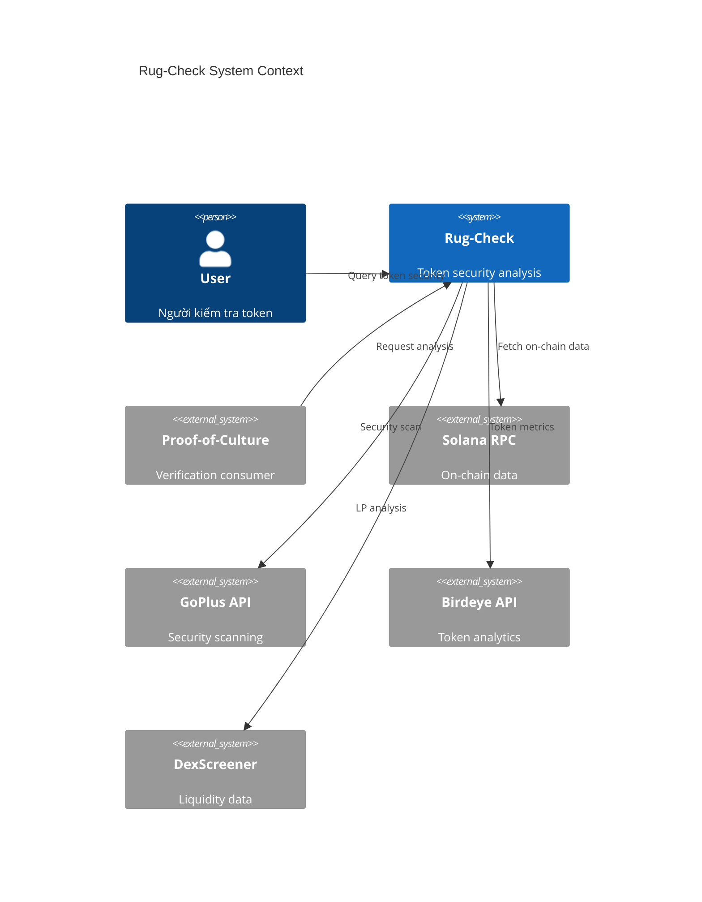
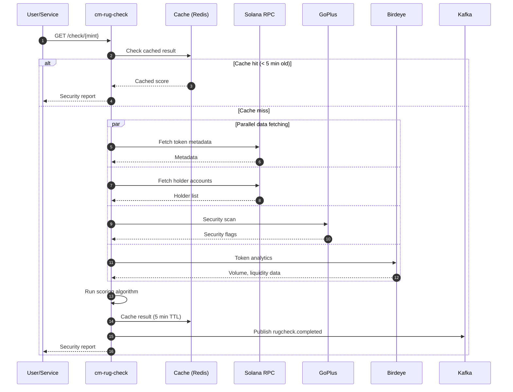
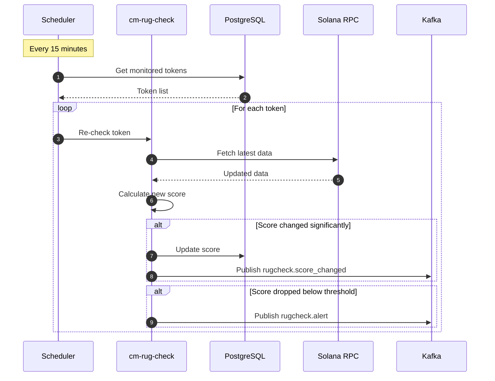
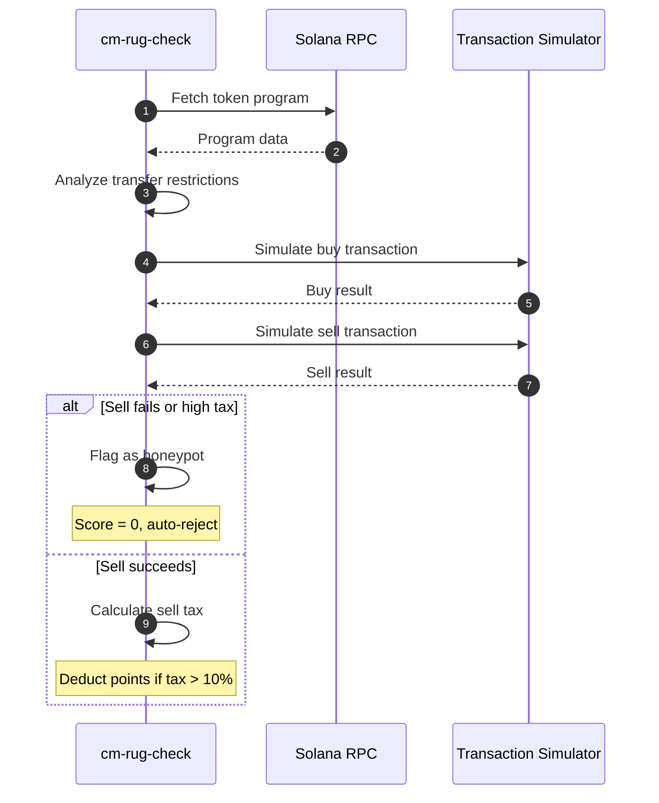
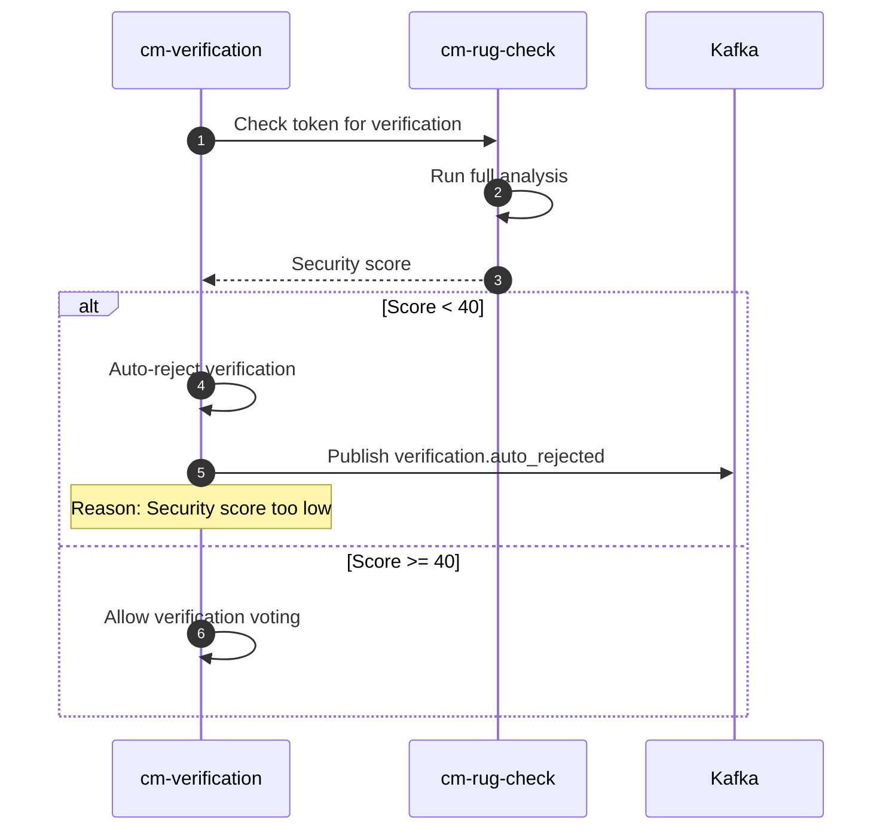
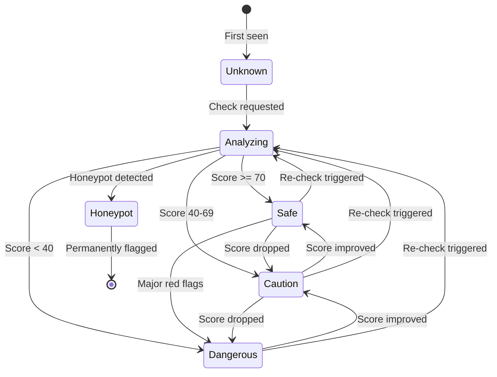
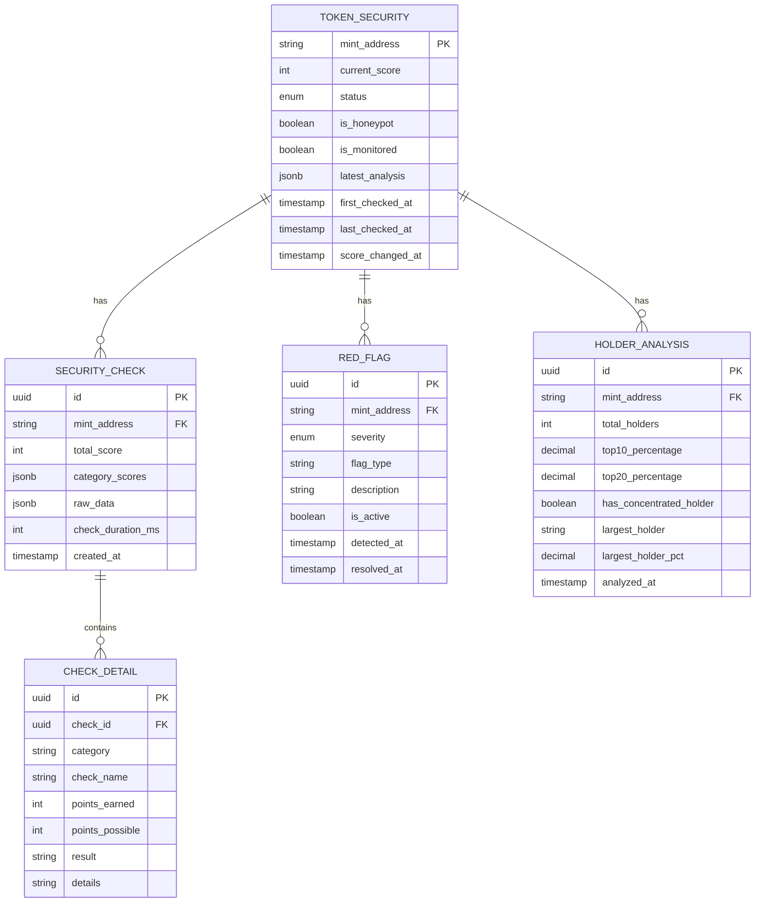
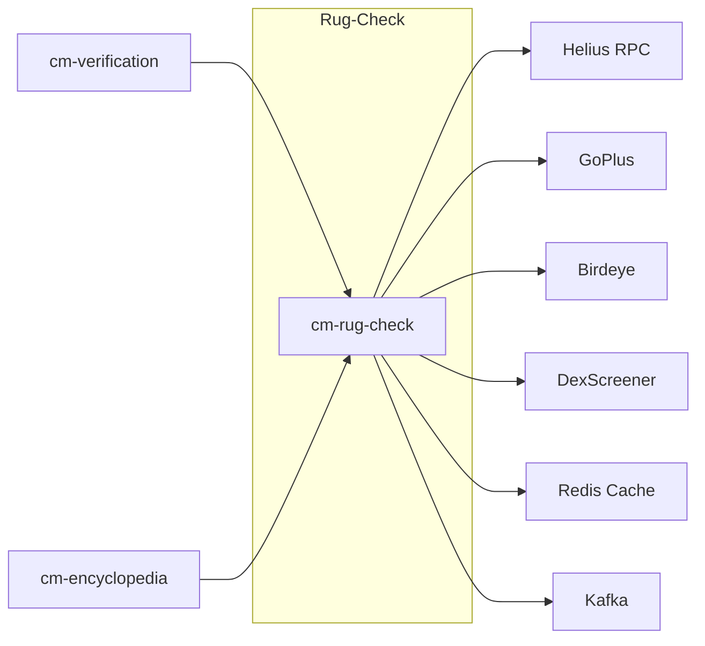

# HLD-CM-RUG-CHECK - Hệ thống Kiểm tra An ninh Token

> **Feature**: Tự động phân tích và đánh giá rủi ro token meme
>
> **Service**: `cm-rug-check` (Node.js/Fastify)
>
> **Version**: 1.0 | **Last Updated**: 2025-01

---

## 📋 Mục lục

1. [Bối cảnh (Context)](#1-bối-cảnh-context)
2. [Context Diagram](#2-context-diagram)
3. [Core Business Workflows](#3-core-business-workflows)
4. [State Machine](#4-state-machine)
5. [Data Model](#5-data-model)
6. [Scoring Algorithm](#6-scoring-algorithm)
7. [API Contracts](#7-api-contracts)
8. [Integration Points](#8-integration-points)
9. [Non-Functional Requirements](#9-non-functional-requirements)
10. [Appendix](#10-appendix)

---

## 1. Bối cảnh (Context)

### 1.1 Bối cảnh Kinh doanh

**Vấn đề:**
- Thị trường meme coin tràn ngập scam và rug pulls
- Nhà đầu tư thiếu công cụ đánh giá rủi ro nhanh
- Các dự án lừa đảo gây thiệt hại lớn cho cộng đồng
- Thiếu tiêu chuẩn đánh giá an ninh token

**Giải pháp Rug-Check:**
- Phân tích tự động on-chain data của token
- Scoring system đánh giá mức độ rủi ro
- Cảnh báo real-time khi phát hiện red flags
- Tích hợp với Proof-of-Culture để auto-reject tokens nguy hiểm

**Giá trị mang lại:**
| Stakeholder | Giá trị |
|-------------|---------|
| Nhà đầu tư | Tránh được scam, quyết định thông minh hơn |
| Curators | Dữ liệu hỗ trợ verification |
| Platform | Bảo vệ uy tín, giảm liability |
| Dự án legit | Được tin tưởng khi pass check |

### 1.2 Bối cảnh Hệ thống

**Rug-Check** cung cấp:

1. **Token Analysis** - Phân tích metadata và on-chain data
2. **Holder Analysis** - Phân tích distribution và concentration
3. **Liquidity Analysis** - Đánh giá liquidity pool health
4. **Contract Analysis** - Kiểm tra honeypot và malicious code
5. **Social Analysis** - Cross-reference với social signals

**Services liên quan:**
- `cm-rug-check` (Node.js/Fastify) - Core analysis
- `cm-verification` (Rust) - Consumer of security scores
- External APIs - GoPlus, Birdeye, DexScreener

### 1.3 Phạm vi Ngoài (Out of Scope)

| Phạm vi trong | Phạm vi ngoài |
|---------------|---------------|
| On-chain analysis | Smart contract audit |
| Automated scoring | Manual security review |
| Real-time monitoring | Historical forensics |
| Basic honeypot detection | Advanced exploit analysis |
| Holder distribution | Individual wallet tracking |

### 1.4 Actors & Permissions

| Actor | Mô tả | Permissions |
|-------|-------|-------------|
| **User** | Người tra cứu token | Query security score |
| **Verification Service** | cm-verification | Trigger analysis |
| **Admin** | Platform operator | Configure thresholds |
| **External APIs** | GoPlus, Birdeye | Provide data |

---

## 2. Context Diagram



---

## 3. Core Business Workflows

### 3.1 Token Security Check Flow



### 3.2 Continuous Monitoring Flow



### 3.3 Honeypot Detection Flow



### 3.4 Auto-Reject Integration Flow



---

## 4. State Machine

### 4.1 Token Security Status



---

## 5. Data Model

### 5.1 Entity Relationship Diagram



### 5.2 Key Entities

| Entity | Mô tả | Storage |
|--------|-------|---------|
| `TOKEN_SECURITY` | Trạng thái bảo mật token | PostgreSQL + Redis |
| `SECURITY_CHECK` | Lịch sử kiểm tra | PostgreSQL |
| `CHECK_DETAIL` | Chi tiết từng check | PostgreSQL |
| `RED_FLAG` | Các cảnh báo phát hiện | PostgreSQL |
| `HOLDER_ANALYSIS` | Phân tích holder | PostgreSQL |

---

## 6. Scoring Algorithm

### 6.1 Score Categories

| Category | Weight | Max Points | Checks |
|----------|--------|------------|--------|
| **Token Metadata** | 15% | 15 | Name, symbol, decimals, URI |
| **Holder Distribution** | 25% | 25 | Concentration, whale analysis |
| **Liquidity** | 25% | 25 | LP locked, LP value, depth |
| **Contract Safety** | 20% | 20 | Honeypot, mint authority, freeze |
| **Trading Activity** | 15% | 15 | Volume, age, buy/sell ratio |

**Total: 100 points**

### 6.2 Detailed Scoring Rules

#### Token Metadata (15 points)
| Check | Points | Criteria |
|-------|--------|----------|
| Valid name | 3 | Name exists, not placeholder |
| Valid symbol | 3 | Symbol exists, 2-10 chars |
| Correct decimals | 3 | Standard decimals (6 or 9) |
| Has metadata URI | 3 | Valid IPFS/Arweave URI |
| Verified metadata | 3 | Metadata matches on-chain |

#### Holder Distribution (25 points)
| Check | Points | Criteria |
|-------|--------|----------|
| Holder count | 5 | > 100 holders |
| Top 10 concentration | 10 | Top 10 hold < 50% |
| No single whale | 5 | No holder > 10% (excl. LP) |
| Distribution spread | 5 | Gini coefficient < 0.8 |

#### Liquidity (25 points)
| Check | Points | Criteria |
|-------|--------|----------|
| LP exists | 5 | Has active LP on Raydium/Orca |
| LP value | 10 | LP value > $10,000 |
| LP locked | 5 | LP tokens locked/burned |
| Depth | 5 | < 5% slippage for $1000 swap |

#### Contract Safety (20 points)
| Check | Points | Criteria |
|-------|--------|----------|
| No honeypot | 10 | Sell simulation succeeds |
| Mint disabled | 5 | Mint authority revoked |
| No freeze | 5 | Freeze authority revoked |

#### Trading Activity (15 points)
| Check | Points | Criteria |
|-------|--------|----------|
| Token age | 5 | > 24 hours since first trade |
| Volume 24h | 5 | > $1,000 daily volume |
| Buy/sell ratio | 5 | Ratio between 0.3 - 3.0 |

### 6.3 Red Flag Penalties

| Red Flag | Penalty | Auto-Reject |
|----------|---------|-------------|
| Honeypot detected | -100 | Yes |
| Mint authority active | -20 | If score < 50 |
| Top holder > 30% | -15 | No |
| LP < $1,000 | -10 | No |
| Token age < 1 hour | -10 | No |
| Fake metadata | -15 | If score < 50 |

### 6.4 Score Interpretation

| Score Range | Status | Meaning |
|-------------|--------|---------|
| 80-100 | Safe | Low risk, basic checks passed |
| 60-79 | Generally Safe | Some minor concerns |
| 40-59 | Caution | Significant risks present |
| 20-39 | Dangerous | High risk, avoid |
| 0-19 | Critical | Likely scam/honeypot |

---

## 7. API Contracts

### 7.1 GraphQL Schema

```graphql
# Types
type TokenSecurity {
  mint: String!
  score: Int!
  status: SecurityStatus!
  isHoneypot: Boolean!
  isMonitored: Boolean!
  analysis: SecurityAnalysis!
  redFlags: [RedFlag!]!
  holderAnalysis: HolderAnalysis
  lastCheckedAt: DateTime!
  scoreChangedAt: DateTime
}

enum SecurityStatus {
  UNKNOWN
  ANALYZING
  SAFE
  CAUTION
  DANGEROUS
  HONEYPOT
}

type SecurityAnalysis {
  categoryScores: CategoryScores!
  checks: [SecurityCheck!]!
  summary: String!
  recommendations: [String!]!
}

type CategoryScores {
  metadata: Int!
  holders: Int!
  liquidity: Int!
  contract: Int!
  trading: Int!
}

type SecurityCheck {
  category: String!
  name: String!
  pointsEarned: Int!
  pointsPossible: Int!
  result: CheckResult!
  details: String
}

enum CheckResult {
  PASS
  WARN
  FAIL
  SKIP
}

type RedFlag {
  id: ID!
  severity: Severity!
  type: String!
  description: String!
  isActive: Boolean!
  detectedAt: DateTime!
}

enum Severity {
  LOW
  MEDIUM
  HIGH
  CRITICAL
}

type HolderAnalysis {
  totalHolders: Int!
  top10Percentage: Float!
  top20Percentage: Float!
  hasConcentratedHolder: Boolean!
  largestHolder: String
  largestHolderPercentage: Float
  distribution: [HolderBucket!]!
}

type HolderBucket {
  range: String!
  count: Int!
  percentage: Float!
}

# Queries
type Query {
  # Security check
  tokenSecurity(mint: String!): TokenSecurity!

  # Batch check
  tokenSecurityBatch(mints: [String!]!): [TokenSecurity!]!

  # History
  securityCheckHistory(
    mint: String!
    first: Int = 10
  ): [SecurityCheckRecord!]!

  # Monitoring
  monitoredTokens: [TokenSecurity!]!

  # Stats
  rugCheckStats: RugCheckStats!
}

type SecurityCheckRecord {
  id: ID!
  score: Int!
  analysis: SecurityAnalysis!
  createdAt: DateTime!
}

type RugCheckStats {
  totalChecks: Int!
  honeypotDetected: Int!
  averageScore: Float!
  checksToday: Int!
}

# Mutations
type Mutation {
  # Request fresh check
  requestSecurityCheck(mint: String!): TokenSecurity!

  # Add to monitoring
  addToMonitoring(mint: String!): Boolean!

  # Remove from monitoring
  removeFromMonitoring(mint: String!): Boolean!

  # Admin: Update thresholds
  updateThresholds(input: ThresholdInput!): Boolean!
}

input ThresholdInput {
  autoRejectScore: Int
  cautionScore: Int
  safeScore: Int
}

# Subscriptions
type Subscription {
  securityScoreChanged(mint: String!): TokenSecurity!
  securityAlert: SecurityAlert!
}

type SecurityAlert {
  mint: String!
  alertType: AlertType!
  previousScore: Int!
  newScore: Int!
  reason: String!
  timestamp: DateTime!
}

enum AlertType {
  SCORE_DROPPED
  HONEYPOT_DETECTED
  WHALE_MOVEMENT
  LP_REMOVED
}
```

### 7.2 REST Endpoints

| Method | Endpoint | Mô tả |
|--------|----------|-------|
| `GET` | `/api/v1/check/{mint}` | Get security score |
| `POST` | `/api/v1/check` | Request fresh check |
| `GET` | `/api/v1/check/{mint}/history` | Get check history |
| `GET` | `/api/v1/batch` | Batch check (max 10) |
| `POST` | `/api/v1/monitor` | Add to monitoring |
| `DELETE` | `/api/v1/monitor/{mint}` | Remove from monitoring |
| `GET` | `/api/v1/stats` | Get service stats |

### 7.3 Response Examples

**GET /api/v1/check/{mint}**
```json
{
  "mint": "7xKXtg2CW87d97TXJSDpbD5jBkheTqA83TZRuJosgAsU",
  "score": 72,
  "status": "SAFE",
  "isHoneypot": false,
  "analysis": {
    "categoryScores": {
      "metadata": 12,
      "holders": 20,
      "liquidity": 18,
      "contract": 15,
      "trading": 7
    },
    "summary": "Token appears generally safe with some minor concerns about holder concentration.",
    "recommendations": [
      "Top 10 holders own 45% - monitor for whale movements",
      "Token is less than 48 hours old - exercise caution"
    ]
  },
  "redFlags": [
    {
      "severity": "MEDIUM",
      "type": "CONCENTRATED_HOLDINGS",
      "description": "Top holder owns 12% of supply",
      "isActive": true
    }
  ],
  "holderAnalysis": {
    "totalHolders": 847,
    "top10Percentage": 45.2,
    "top20Percentage": 58.1,
    "hasConcentratedHolder": true,
    "largestHolder": "5abc...xyz",
    "largestHolderPercentage": 12.3
  },
  "lastCheckedAt": "2025-01-15T10:30:00Z"
}
```

---

## 8. Integration Points

### 8.1 External Integrations

| System | Integration Type | Mục đích |
|--------|------------------|----------|
| **Helius RPC** | Solana RPC | On-chain data |
| **GoPlus API** | REST API | Security scanning |
| **Birdeye API** | REST API | Token analytics |
| **DexScreener API** | REST API | LP data |

### 8.2 Internal Service Dependencies



### 8.3 Data Flow Summary

| Source | Destination | Data | Protocol |
|--------|-------------|------|----------|
| cm-rug-check | Helius | Token/holder queries | RPC |
| cm-rug-check | GoPlus | Security scan | REST |
| cm-rug-check | Birdeye | Analytics | REST |
| cm-rug-check | Redis | Cached scores | Redis |
| cm-rug-check | Kafka | Alerts, events | Kafka |

---

## 9. Non-Functional Requirements

### 9.1 Performance

| Metric | Target | Đo lường |
|--------|--------|----------|
| Fresh check | < 5s | End-to-end |
| Cached check | < 100ms | P95 latency |
| Batch check (10) | < 10s | Parallel processing |
| Monitoring cycle | < 15 min | Full scan |

### 9.2 Scalability

| Dimension | Target |
|-----------|--------|
| Checks per hour | 10,000+ |
| Monitored tokens | 50,000+ |
| Concurrent requests | 500+ |
| Cache hit rate | > 80% |

### 9.3 Security

| Aspect | Requirement |
|--------|-------------|
| Rate limiting | 100 req/min per IP |
| Input validation | Strict mint address format |
| API authentication | Required for mutations |
| Data integrity | Signed check results |

### 9.4 Availability

| Component | Target SLA |
|-----------|------------|
| API | 99.9% |
| Monitoring | 99.5% |
| External API fallback | Graceful degradation |

---

## 10. Appendix

### 10.1 Honeypot Detection Techniques

| Technique | Description |
|-----------|-------------|
| Transfer simulation | Simulate buy → sell flow |
| Tax analysis | Check for hidden sell tax |
| Balance manipulation | Detect balance freezing |
| Blacklist check | Check for address blacklists |
| Approval analysis | Check for approval revocation |

### 10.2 Common Rug Pull Patterns

| Pattern | Detection |
|---------|-----------|
| LP removal | Monitor LP account balance |
| Mint exploit | Check mint authority status |
| Whale dump | Track large holder movements |
| Honeypot enable | Monitor contract upgrades |
| Fake volume | Analyze wash trading patterns |

### 10.3 External API Rate Limits

| API | Rate Limit | Fallback |
|-----|------------|----------|
| Helius | 100 RPS | Multiple RPC endpoints |
| GoPlus | 50 RPM | Cache aggressively |
| Birdeye | 100 RPM | Use cached data |
| DexScreener | 300 RPM | Local LP calculation |

### 10.4 Monitoring Alert Thresholds

| Alert Type | Trigger |
|------------|---------|
| Score dropped | Score decreases by > 20 points |
| Honeypot detected | Any honeypot detection |
| Whale movement | > 5% of supply moved |
| LP removed | LP value drops > 50% |
| Suspicious activity | Multiple red flags in 1 hour |

### 10.5 Related Documents

- [HLD-CM-PROOF-OF-CULTURE.md](../Core/HLD-CM-PROOF-OF-CULTURE.md) - Verification integration
- [HLD-CM-SWAP-AGGREGATOR.md](./HLD-CM-SWAP-AGGREGATOR.md) - Trading safety
- [Tech-Stack.md](../../../Design/Tech-Stack.md) - Technology stack
