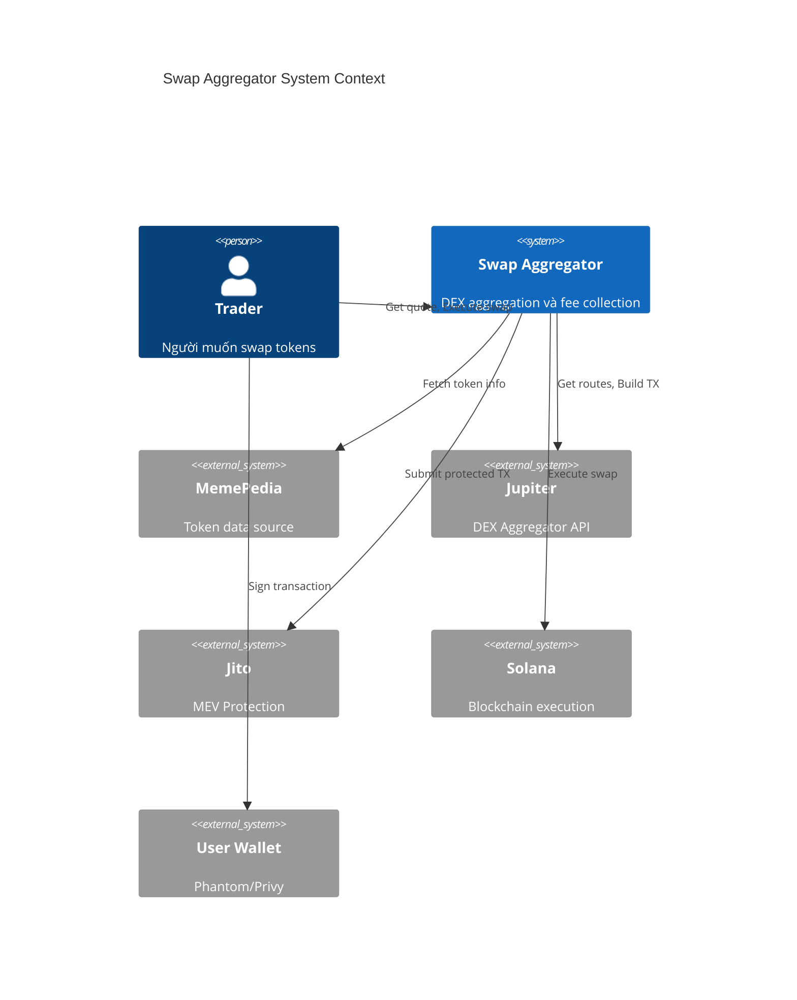
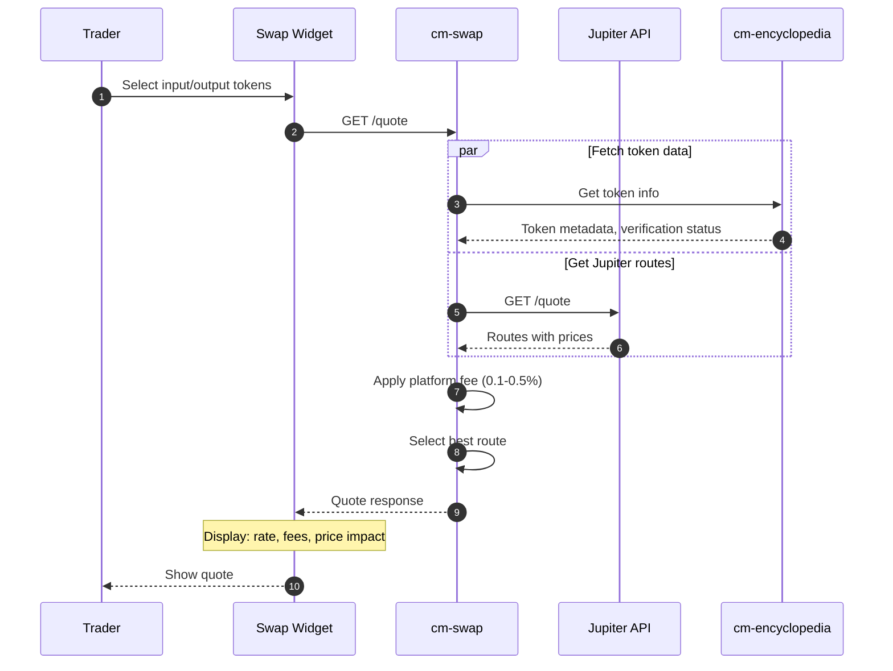
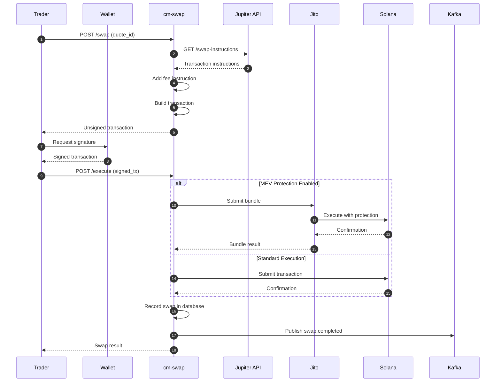
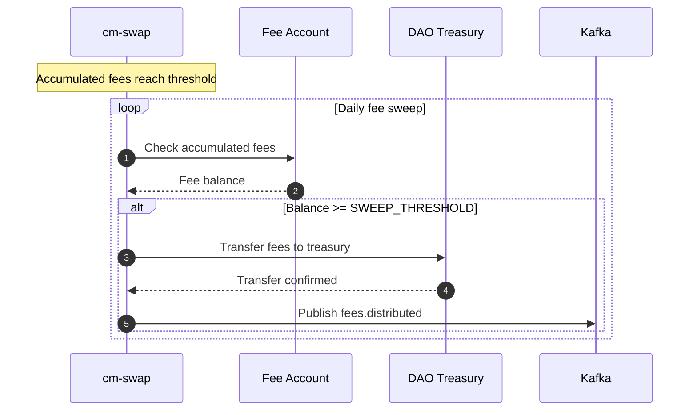
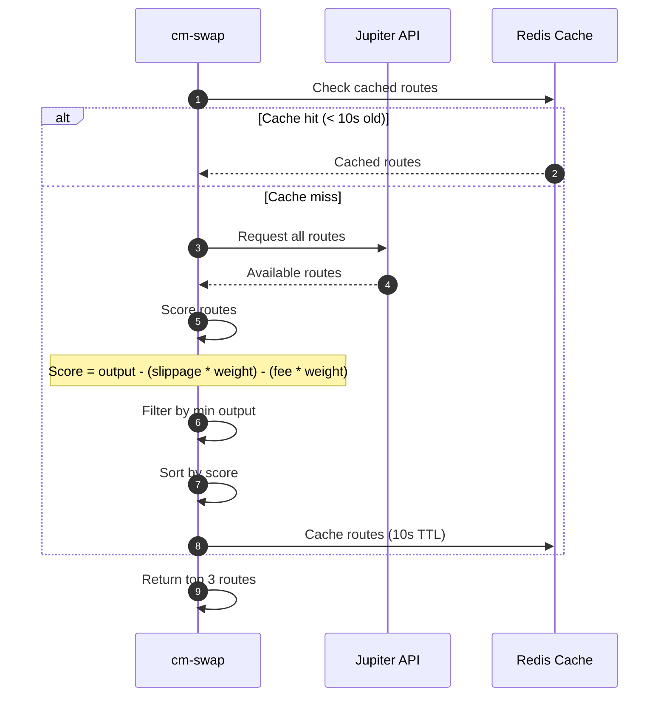
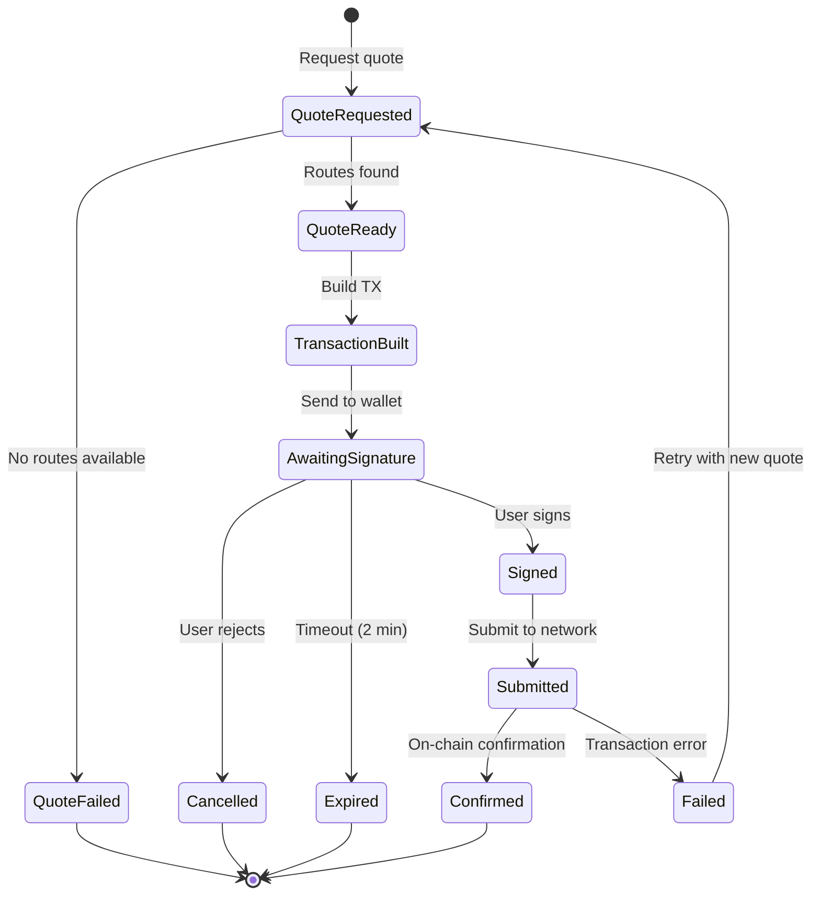
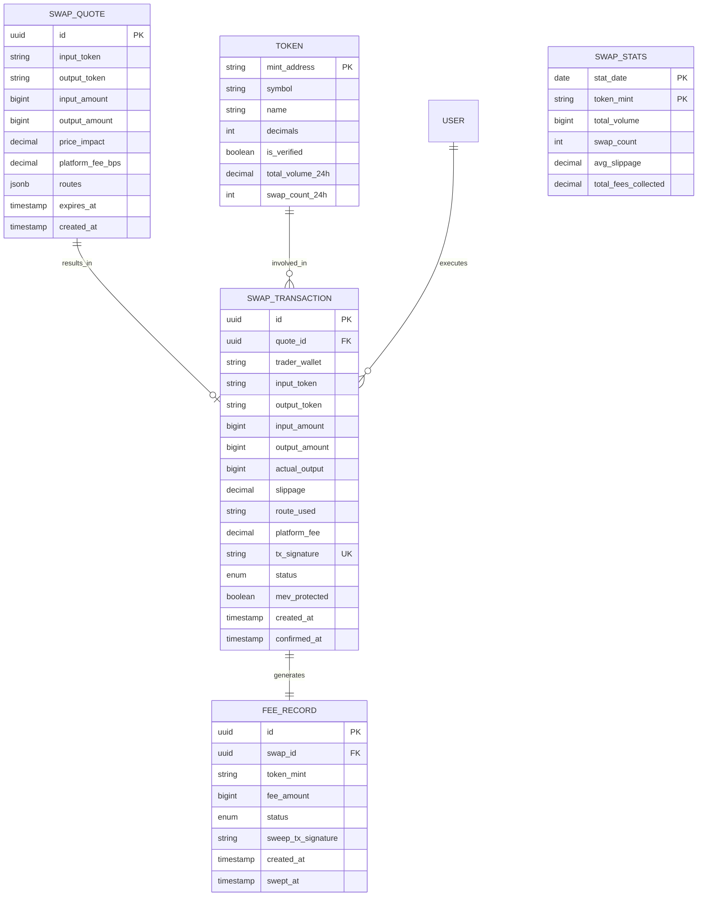
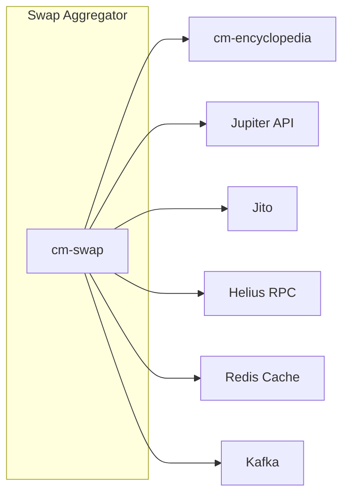

# HLD-CM-SWAP-AGGREGATOR - Swap Aggregator & Trading Widget

> **Feature**: Tích hợp DEX Aggregator để swap meme coins trực tiếp từ encyclopedia
>
> **Service**: `cm-swap` (Rust/Actix)
>
> **Version**: 1.0 | **Last Updated**: 2025-01

---

## 📋 Mục lục

1. [Bối cảnh (Context)](#1-bối-cảnh-context)
2. [Context Diagram](#2-context-diagram)
3. [Core Business Workflows](#3-core-business-workflows)
4. [State Machine](#4-state-machine)
5. [Data Model](#5-data-model)
6. [Event Architecture](#6-event-architecture)
7. [API Contracts](#7-api-contracts)
8. [Integration Points](#8-integration-points)
9. [Non-Functional Requirements](#9-non-functional-requirements)
10. [Appendix](#10-appendix)

---

## 1. Bối cảnh (Context)

### 1.1 Bối cảnh Kinh doanh

**Vấn đề:**
- Người dùng phải rời CryptoMeme để giao dịch trên DEXs khác
- Tăng friction, mất conversion trong user journey
- Không capture được giá trị từ trading volume
- Khó theo dõi và phân tích hành vi giao dịch

**Giải pháp Swap Aggregator:**
- Tích hợp Jupiter Aggregator (Solana #1 DEX) trực tiếp trong encyclopedia
- Swap widget nhúng trong trang meme profile
- Thu phí giao dịch nhỏ (0.1-0.5%) làm revenue stream
- MEV protection qua Jito integration

**Giá trị mang lại:**
| Stakeholder | Giá trị |
|-------------|---------|
| Nhà đầu tư | Giao dịch nhanh, tiện lợi ngay tại nơi research |
| Platform | Revenue từ trading fees |
| DAO Treasury | Phí giao dịch đóng góp vào quỹ |
| Token projects | Tăng liquidity và visibility |

### 1.2 Bối cảnh Hệ thống

**Swap Aggregator** cung cấp:

1. **Route Optimization** - Tìm route tốt nhất qua Jupiter
2. **Swap Execution** - Thực hiện swap với slippage protection
3. **Fee Collection** - Thu phí và phân phối cho DAO
4. **MEV Protection** - Sử dụng Jito bundles để bảo vệ giao dịch
5. **Analytics** - Theo dõi volume, popular pairs

**Services liên quan:**
- `cm-swap` (Rust/Actix) - Core swap logic
- `cm-encyclopedia` (Rust) - Meme data provider
- Jupiter API - Route aggregation
- Jito - MEV protection

### 1.3 Phạm vi Ngoài (Out of Scope)

| Phạm vi trong | Phạm vi ngoài |
|---------------|---------------|
| Jupiter integration | Custom AMM development |
| Basic swap widget | Advanced trading UI (limit orders, charts) |
| Fee collection | Fiat on/off-ramp |
| Volume tracking | Market making |
| MEV protection | Arbitrage detection |

### 1.4 Actors & Permissions

| Actor | Mô tả | Permissions |
|-------|-------|-------------|
| **Trader** | Người thực hiện swap | Quote, Swap, View history |
| **Verified Meme** | Token đã xác thực | Higher visibility, lower fees |
| **Platform** | CryptoMeme system | Collect fees, configure rates |
| **DAO** | Governance | Update fee structure |

---

## 2. Context Diagram



---

## 3. Core Business Workflows

### 3.1 Get Quote Flow



### 3.2 Execute Swap Flow



### 3.3 Fee Distribution Flow



### 3.4 Route Optimization Flow



---

## 4. State Machine

### 4.1 Swap Transaction States



---

## 5. Data Model

### 5.1 Entity Relationship Diagram



### 5.2 Key Entities

| Entity | Mô tả | Storage |
|--------|-------|---------|
| `SWAP_QUOTE` | Quote request và kết quả | Redis (short TTL) + PostgreSQL |
| `SWAP_TRANSACTION` | Lịch sử swap thực hiện | PostgreSQL |
| `FEE_RECORD` | Phí thu được từ swap | PostgreSQL |
| `TOKEN` | Token metadata cache | PostgreSQL + Redis |
| `SWAP_STATS` | Thống kê daily | PostgreSQL (aggregated) |

---

## 6. Event Architecture

### 6.1 Published Events

| Event | Trigger | Payload | Consumers |
|-------|---------|---------|-----------|
| `swap.quote_requested` | User requests quote | `{input, output, amount}` | cm-analytics |
| `swap.completed` | Swap confirmed | `{swap_id, tokens, amounts, fee}` | cm-analytics, cm-api |
| `swap.failed` | Swap error | `{swap_id, error_code, reason}` | cm-analytics |
| `fees.collected` | New fee recorded | `{token, amount}` | cm-analytics |
| `fees.distributed` | Fees sent to DAO | `{total, tx_signature}` | cm-notification |

### 6.2 Consumed Events

| Event | Source | Handler |
|-------|--------|---------|
| `meme.verified` | cm-verification | Update token verification status |
| `token.price_updated` | cm-coingecko-sync | Update cached prices |
| `token.rug_detected` | cm-rug-check | Disable swaps for token |

---

## 7. API Contracts

### 7.1 GraphQL Schema

```graphql
# Types
type SwapQuote {
  id: ID!
  inputToken: Token!
  outputToken: Token!
  inputAmount: String!
  outputAmount: String!
  minimumReceived: String!
  priceImpact: Float!
  platformFee: Float!
  platformFeeBps: Int!
  routes: [SwapRoute!]!
  expiresAt: DateTime!
}

type SwapRoute {
  name: String!
  inputAmount: String!
  outputAmount: String!
  priceImpact: Float!
  steps: [RouteStep!]!
}

type RouteStep {
  ammId: String!
  ammLabel: String!
  inputMint: String!
  outputMint: String!
  inputAmount: String!
  outputAmount: String!
  feeAmount: String!
}

type Token {
  mint: String!
  symbol: String!
  name: String!
  decimals: Int!
  logoUri: String
  isVerified: Boolean!
  cultureSeal: CultureSeal
  price: Float
}

type SwapTransaction {
  id: ID!
  inputToken: Token!
  outputToken: Token!
  inputAmount: String!
  outputAmount: String!
  actualOutput: String
  slippage: Float!
  platformFee: String!
  txSignature: String
  status: SwapStatus!
  mevProtected: Boolean!
  createdAt: DateTime!
  confirmedAt: DateTime
}

enum SwapStatus {
  QUOTE_READY
  AWAITING_SIGNATURE
  SUBMITTED
  CONFIRMED
  FAILED
  CANCELLED
  EXPIRED
}

type SwapStats {
  token: Token!
  volume24h: String!
  swapCount24h: Int!
  avgSlippage: Float!
}

# Queries
type Query {
  # Quote
  swapQuote(
    inputMint: String!
    outputMint: String!
    amount: String!
    slippageBps: Int = 50
  ): SwapQuote!

  # Token
  swappableTokens(
    search: String
    verifiedOnly: Boolean = false
    first: Int = 50
  ): [Token!]!

  tokenInfo(mint: String!): Token

  # History
  mySwapHistory(
    first: Int = 20
    after: String
  ): SwapTransactionConnection!

  swapTransaction(id: ID!): SwapTransaction

  # Stats
  topSwappedTokens(
    timeframe: Timeframe = DAY
    first: Int = 20
  ): [SwapStats!]!

  platformSwapStats(timeframe: Timeframe = DAY): PlatformSwapStats!
}

type PlatformSwapStats {
  totalVolume: String!
  totalSwaps: Int!
  totalFeesCollected: String!
  uniqueTraders: Int!
}

# Mutations
type Mutation {
  # Swap execution
  buildSwapTransaction(
    quoteId: ID!
    userWallet: String!
    mevProtection: Boolean = true
  ): SwapTransactionData!

  executeSwap(
    quoteId: ID!
    signedTransaction: String!
  ): SwapTransaction!

  cancelSwap(swapId: ID!): Boolean!
}

type SwapTransactionData {
  swapId: ID!
  transaction: String!  # Base64 encoded
  expiresAt: DateTime!
}

# Subscriptions
type Subscription {
  swapStatusUpdated(swapId: ID!): SwapTransaction!
}
```

### 7.2 REST Endpoints

| Method | Endpoint | Mô tả |
|--------|----------|-------|
| `GET` | `/api/v1/swap/quote` | Get swap quote |
| `POST` | `/api/v1/swap/transaction` | Build swap transaction |
| `POST` | `/api/v1/swap/execute` | Execute signed swap |
| `GET` | `/api/v1/swap/{id}` | Get swap status |
| `GET` | `/api/v1/swap/history` | Get user swap history |
| `GET` | `/api/v1/tokens` | List swappable tokens |
| `GET` | `/api/v1/tokens/{mint}` | Get token info |

### 7.3 Jupiter API Integration

```rust
// Jupiter Quote Request
pub struct JupiterQuoteRequest {
    pub input_mint: String,
    pub output_mint: String,
    pub amount: u64,
    pub slippage_bps: u16,
    pub only_direct_routes: bool,
    pub as_legacy_transaction: bool,
}

// Jupiter Quote Response
pub struct JupiterQuoteResponse {
    pub input_mint: String,
    pub output_mint: String,
    pub in_amount: String,
    pub out_amount: String,
    pub other_amount_threshold: String,
    pub swap_mode: String,
    pub slippage_bps: u16,
    pub price_impact_pct: f64,
    pub route_plan: Vec<RoutePlanStep>,
}

// Jupiter Swap Request
pub struct JupiterSwapRequest {
    pub quote_response: JupiterQuoteResponse,
    pub user_public_key: String,
    pub wrap_and_unwrap_sol: bool,
    pub use_shared_accounts: bool,
    pub fee_account: Option<String>,
    pub compute_unit_price_micro_lamports: Option<u64>,
}
```

---

## 8. Integration Points

### 8.1 External Integrations

| System | Integration Type | Mục đích |
|--------|------------------|----------|
| **Jupiter API** | REST API | Route aggregation |
| **Jito Block Engine** | gRPC | MEV protection |
| **Helius RPC** | Solana RPC | Transaction submission |
| **Privy** | SDK | Wallet connection |

### 8.2 Internal Service Dependencies



### 8.3 Data Flow Summary

| Source | Destination | Data | Protocol |
|--------|-------------|------|----------|
| cm-swap | Jupiter | Quote/Swap requests | REST |
| cm-swap | Jito | Protected bundles | gRPC |
| cm-swap | Helius | Transaction submission | JSON-RPC |
| cm-swap | Redis | Quote caching | Redis protocol |
| cm-swap | Kafka | Swap events | Kafka |

---

## 9. Non-Functional Requirements

### 9.1 Performance

| Metric | Target | Đo lường |
|--------|--------|----------|
| Quote latency | < 500ms | P95 latency |
| Swap execution | < 2s (excluding confirmation) | P95 latency |
| Route caching | 10s TTL | Cache hit rate > 80% |
| Concurrent quotes | 1000+ QPS | Load test |

### 9.2 Scalability

| Dimension | Target |
|-----------|--------|
| Daily swaps | 100,000+ |
| Concurrent users | 10,000+ |
| Token pairs | Unlimited (via Jupiter) |
| Route options | Top 5 per quote |

### 9.3 Security

| Aspect | Requirement |
|--------|-------------|
| Transaction integrity | Signature verification |
| MEV protection | Jito bundles by default |
| Slippage protection | User-defined max slippage |
| Rate limiting | 10 quotes/s per user |

### 9.4 Availability

| Component | Target SLA |
|-----------|------------|
| Quote API | 99.9% |
| Swap execution | 99.5% |
| Jupiter dependency | Fallback to direct routes |

---

## 10. Appendix

### 10.1 Fee Structure

| Token Type | Platform Fee | DAO Share | Notes |
|------------|--------------|-----------|-------|
| Verified (Culture Seal) | 0.1% | 80% | Lowest fee tier |
| Unverified | 0.3% | 80% | Standard fee |
| New/Risky | 0.5% | 80% | Higher fee for protection |

### 10.2 MEV Protection Options

| Option | Provider | Benefit | Tradeoff |
|--------|----------|---------|----------|
| Jito Bundle | Jito | Best protection | Slight delay |
| Priority Fee | Helius | Faster | Less protection |
| Standard | Default RPC | Cheapest | No protection |

### 10.3 Slippage Recommendations

| Market Condition | Recommended Slippage |
|------------------|---------------------|
| High liquidity pairs | 0.5% |
| Medium liquidity | 1-2% |
| Low liquidity meme coins | 5-10% |
| New launches | 10-15% |

### 10.4 Error Codes

| Code | Description | User Action |
|------|-------------|-------------|
| `INSUFFICIENT_LIQUIDITY` | Not enough liquidity | Try smaller amount |
| `SLIPPAGE_EXCEEDED` | Price moved too much | Increase slippage |
| `TOKEN_FROZEN` | Token account frozen | Check token status |
| `ROUTE_NOT_FOUND` | No viable route | Try different pair |
| `QUOTE_EXPIRED` | Quote timed out | Request new quote |
| `SIGNATURE_INVALID` | Bad transaction signature | Re-sign transaction |

### 10.5 Related Documents

- [HLD-CM-MEMEPEDIA.md](../Core/HLD-CM-MEMEPEDIA.md) - Token data source
- [HLD-CM-RUG-CHECK.md](./HLD-CM-RUG-CHECK.md) - Token safety check
- [Tech-Stack.md](../../../Design/Tech-Stack.md) - Technology stack
